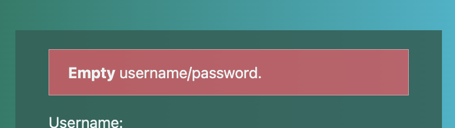
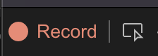
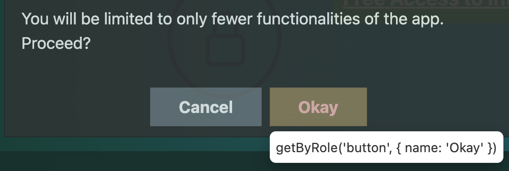
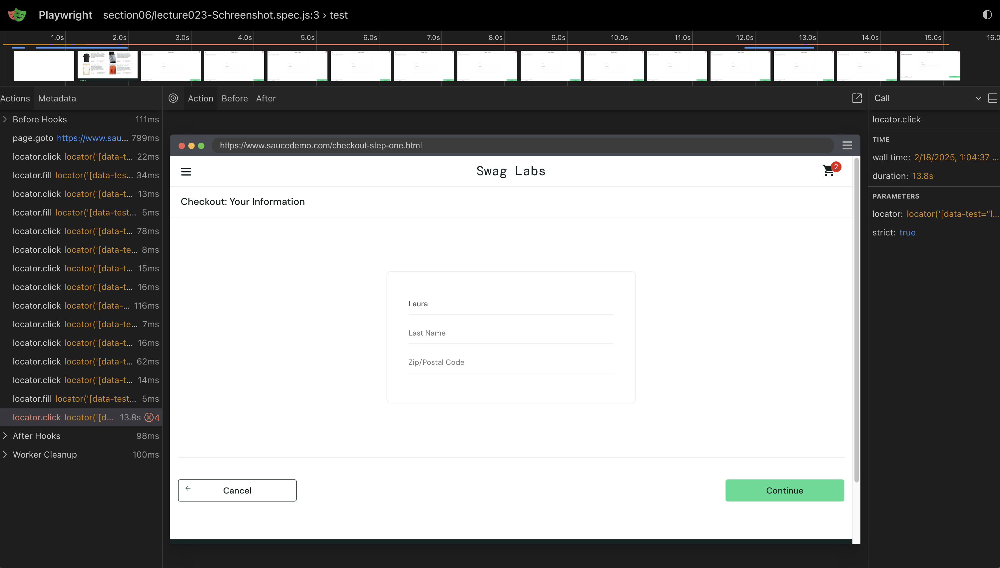
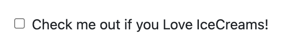
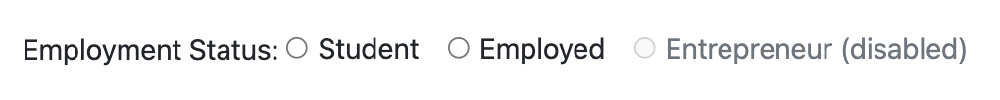
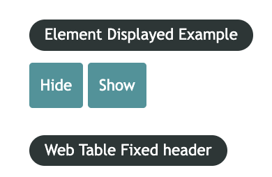
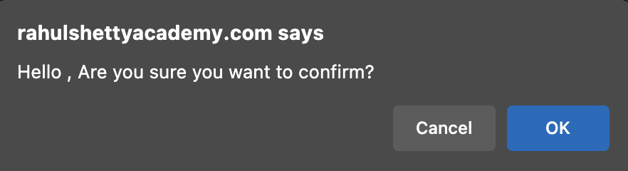
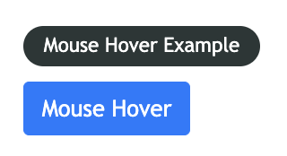

# Section 01 - Introduction to Playwright Automation & Course expectations

1. Appendix - Learn JavaScript Fundamentals from Scratch for Automation
2. How this Course is designed? Topics Breakup
3. HInstall Node.js & Visual Studio for setting up Playwright Environment

# Section 02 - 3 hours of Javascript Fundamentals including coding exercises

# Section 03 - Getting started with Playwright Automation Core concepts

# Section 04 - Playwright Basic methods for web automation testing with examples

# Section 05 - Handling UI Components(Dropdowns ,Radio Buttons, Childwindows) with Playwright

# Section 06 - Learn Playwright inspectors, Trace Viewers & Codegen tools with Demo examples

# Section 07 - End to End Web Automation practice exercise with Playwright

# Section 08 - Playwright Unique GetBy Locators for Smart Testing & Test Runner usage

# Section 09 - Handling Web dialogs, Frames & Event listeners with Playwright

# Section 10 - API Testing with Playwright and Build mix of Web & API tests

# Section 11 - Session storage & Intercepting Network request/responses with Playwright

# Section 12 - Perform Visual Testing with Playwright Algorithms

# Section 13 - Build Excel Utils and drive uploads downloads using Playwright

# Section 14 - Page Object Patterns & Data driven Parameterization for Playwright Tests

# Section 15 - Project Configurations, & Config options for robust Framework design

# Section 16 - Test Retries , Serial & Parallel execution & Tagging Tests in Playwright

# Section 17 - HTMl & Allure Reporting & CI/CD Jenkins Integration

# Section 18 - Understand TypeScript Basics and Refactor Playwright Framework to TypeScript

# Section 19 - Playwright Cucumber Framework Integration with its features

# Section 20 - E2E Playwright Devops Solution using Azure Cloud Parallel hosting & CI/CD

# Section 21 - Course Code download

# Section 22 - Bonus Lecture

# Section 23 - Appendix - Learn JavaScript Fundamentals from Scratch for Automation

# Lecture 006 - Create npm Project and install Playwright dependencies

## 1. create a Project folder

## 2. Open terminal in project folder path

## 3. run first and second commands:

```javascript
$ npm init -y
$ npm init playwright@latest
```

## 4. select

```javascript
-javascript - tests;
```

## 5. Test runner:

```javascript
Playwright-Project
 ├-- ...
 └-- playwright.config.js
```

## 6. Main folder/Working folder/ Test folder: (step 4)

```javascript
PlaywrightProject
├-- ...
└-- tests
```

## 7. Some Examples

```javascript
const { test, expect } = require('@playwright/test');

test.beforeEach( async ({page}) => {
  ...
});

test.describe('Describe test Title', () => {

  test('Test 01 title', async ({page}) => {
    ...
  });

  test('Test 02 title', async ({page}) => {
    ...
  });
})
```

# Lecture 007 - Importance of Playwright Test annotations and Async await understanding

1. create a new test inside ./tests folder
2. add the following:

```javascript
const { test } = require("@playwright/test");

//test structure:
test("First Playwirght test", function () {
  //playwright code
  //step01 - open browser
  //step02 - enter username & password
  //step03 - click submit button
});
```

3. async anonymous function with await in each step

```javascript
const { test } = require('@playwright/test');

//test structure:
test('First Playwirght test', async () => {
    //playwright code
    //step01 - open browser               => await
    await ....
    //step02 - enter username & password  => await
    await ....
    //step03 - click submit button        => await
    await ....
});
```

# Lecture 008: What is browser context and Page fixture in Playwright?

1. With context and plugins or cookies

```javascript
test("First Playwirght test", async ({ browser }) => {
  //chrome - plugins/cookies/...
  const context = await browser.newContext();
  const page = await context.newPage();

  await page.goto("https://rahulshettyacademy.com/loginpagePractice/");
});
```

2. Without context and plugins or cookies

```javascript
test("First playwright test", async ({ page }) => {
  await page.goto("https://rahulshettyacademy.com/loginpagePractice/");
});
```

# Lecture 009: Importance of Playwright Configuration file and its details to run the tests

```javascript
// @ts-check
const { defineConfig, devices } = require("@playwright/test");

module.exports = defineConfig({
  testDir: "./tests",

  reporter: "html",

  use: {
    trace: "on-first-retry",
  },

  /* Configure projects for major browsers */
  projects: [
    {
      name: "chromium",
      use: { ...devices["Desktop Chrome"] },
    },

    {
      name: "firefox",
      use: { ...devices["Desktop Firefox"] },
    },

    {
      name: "webkit",
      use: { ...devices["Desktop Safari"] },
    },
    {
      name: "Microsoft Edge",
      use: { ...devices["Desktop Edge"], channel: "msedge" },
    },
  ],
});
```

## Run from terminal:

### 1. execute all test cases inside ./tests folder: (headless mode?)

```javascript
$ npx playwright test
```

### 2. execute all test case from `./tests` folder with browser:

```javascript
$ npx playwright test --headed
```

#### 3. Run a specific test:

#### - add `.only` to test as you see here:

```javascript
test.only("test scenario name", async ({ page }) => {});
```

#### - then run command:

```javascript
$ npx playwright test
```

# Lecture 010: Running Playwright tests in multiple browsers - chrome, Firefox 7 Webkit

['Assertions in Playwright'](https://playwright.dev/docs/test-assertions)

1. add the following code:

```Javascript
const { expect } = require('@playwright/test');
```

2. Create a test scenario as follow:

```Javascript
test("second playwright test", async ( {page} ) => {
    // go to webpage:
    await page.goto("https://www.google.com");
    // get its title
    const title = await page.title();
    // make an assertion:
    expect(page).toHaveTitle('Google'); ❌
})
```

It will fail due to `await` is missing.

['Assertions - have title'](https://playwright.dev/docs/api/class-pageassertions#page-assertions-to-have-title)

- Expected title or RegExp.

```javascript
await expect(page).toHaveTitle(/.*checkout/);
```

## headless mode:

```javascript
module.exports = defineConfig({
  use: {
    trace: "on-first-retry",
    headless: true,
  },
});
```

1. run terminal - headless mode:

```javascript
$ npx playwright test
```

2. run terminal - open browser mode:

```javascript
$ npx playwright test --headed
```

## Headed mode:

```javascript
module.exports = defineConfig({
  use: {
    trace: "on-first-retry",
    headless: false,
  },
});
```

1. run in terminal - open browser mode only:

```javascript
$ npx playwright test
```

# Lecture 011: Locators supported by playwright and how to type into elements on page

## Previous setting timeout:

1. setting a `timeout` only for `expect` around `20` seconds.
2. setting `timeout` for all over test is `30` seconds.

```javascript
export default defineConfig({
  timeout: 30 * 10000, //test
  expect: {
    timeout: 20000, //expect section
  },
});
```

## Locators:

1. Since we have following `HTML` code. How can you write a locator in Playwright?

```HTML
  <div class='form-group'>
    <input type='text' name='username' id='username' class='form-control'>
  <div>
```

- If `Id`is present: `tagname#id` || `#id`

  ```CSS
    input#username
    #username
  ```

  ```javascript
  test("First playwright test- using #id locator", async ({ page }) => {
    await page.goto("https://rahulshettyacademy.com/loginpagePractise/");
    await page.locator("#username").fill("luis");
    await page.waitForTimeout(2500);
  });
  ```

  ```javascript
  test("Second playwright test- using tagname#id locator", async ({ page }) => {
    await page.goto("https://rahulshettyacademy.com/loginpagePractise/");
    await page.locator("input#username").fill("Lucho");
    await page.waitForTimeout(2500);
  });
  ```

- If `class` attribute is present: `tagname.class` || `.class`

  ```CSS
    input.form-control
    .form-control
  ```

  ```javascript
  test("Third playwright test- using .class locator", async ({ page }) => {
    await page.goto("https://rahulshettyacademy.com/loginpagePractise/");

    await page.locator(".form-control#username").fill("luismedina");
    await page.waitForTimeout(2500);
  });
  ```

  ```javascript
  test("Fourth playwright test- using `tagname.class` locator", async ({
    page,
  }) => {
    await page.goto("https://rahulshettyacademy.com/loginpagePractise/");

    await page.locator("input.form-control#username").fill("luiggie");
    await page.waitForTimeout(2500);
  });
  ```

- Write CSS based on any `attribute`: `[attribute='value']`

  ```CSS
    [name='username']
  ```

  ```javascript
  test("Fifth playwright test- using attribute locator", async ({ page }) => {
    await page.goto("https://rahulshettyacademy.com/loginpagePractise/");
    await page.locator('[name="username"]').fill("luismedina");
    await page.waitForTimeout(2500);
  });
  ```

  ```javascript
  test("Sixth playwright test- using `tagname attribute` locator", async ({
    page,
  }) => {
    await page.goto("https://rahulshettyacademy.com/loginpagePractise/");

    await page.locator('input[name="username"]').fill("luiggie");
    await page.waitForTimeout(2500);
  });
  ```

- write CSS with `traversing` from `Parent to child`: `parentTagname >> childTagName`

  ```CSS
    .form-group > #username
  ```

  ```javascript
  test("Seventh playwright test- using `tagname attribute` locator", async ({
    page,
  }) => {
    await page.goto("https://rahulshettyacademy.com/loginpagePractise/");

    await page.locator(".form-group #username").fill("luiggie");
    await page.waitForTimeout(2500);
  });
  ```

- If needs to write locator base on `text`: CSS

  ```

  ```

```javascript
page.locator("locator");
```

# Lecture 012: Extracting the text from browser and inserting valid expect assertions in test

## Locators:

```javascript
await page.locator("#username").fill("rahulshetty");
await page.locator('[type="password"]').fill("learning");
await page.locator("#signInBtn").click();
```

## Getting a warning text:

After clicking on `Sign In` button with non existent pr wrong credentials, there's a warning.
[image](./Images/Section03/Warning_in_login_page.png)


### Goal: Extract the text

```html
<div class="alert alert-danger col-md-12" style="display: block;">
  <strong>Empty</strong> username/password.
</div>
```

the attribute which changes everything is `display:block` while this warning is visible, then it turns to `display:none`.

So the locator should be:

```javascript
await page.locator('[style*=block"]');
```

This `*` acts likely as style attribute has some value similarly to `block`.

```javascript
$ npx playwright test --headed tests/section03/01_UIBasicsTest.spec.js
```

### In order to get its text: `.textContent()`

```javascript
const warningText = await page.locator('[style*="block"]').textContent();
console.log(warningText);
```

### In order to assert the text `.toContainText("...")`

#### Create a wrong assertion:

```javascript
const warningText = await page.locator('[style*="block"]').textContent();
...
await expect(page.locator('[style*="block"]')).toContainText('Incorrect1')
```


#### create a right assertion:

```javascript
const warningText = await page.locator('[style*="block"]').textContent();
...
await expect(page.locator('[style*="block"]')).toContainText('Incorrect')
```

when right locator or assertion:


```javascript
await page.waitForTimeout(3000);
```

# Lecture 013: How to work with locators which extract multiple webelements in page

## You can create some variable without `await` for locators:

```javascript
test("Creating variable for locators", async ({ page }) => {
  await page.goto("https://rahulshettyacademy.com/loginpagePractise/");

  //variables: without await
  const username = page.locator("#username");
  const password = page.locator('[type="password"]');
  const signInBtn = page.locator("#signInBtn");

  //actions => `await` is mandatory
  await username.fill("rahulshettyacademy");
  await password.fill("learning");
  await signInBtn.click();
  await page.waitForTimeout(6500);
});
```

## Common error when more than 1 element have same locator:

as you can see in this example, many elements have been found with same locator:

```javascript
await page.locator(".card-body a").textContent();
```


## Using `.nth(0)` or `.first()` in order to get first element:

### using `.nth(0)`

```javascript
await page.locator(".card-body a").nth(0).textContent();
```

### using `.first()`

```javascript
await page.locator(".card-body a").first().textContent();
```

so, `.nth(0)` and `.first()` have the same functionality.

```javascript
await page.locator(".card-body a").first().textContent();
await page.locator(".card-body a").nth(0).textContent();
await page.locator(".card-body a").nth(1).textContent();
await page.locator(".card-body a").nth(2).textContent();
```

# Lecture 014 - Understanding how wait mechanism works if list of elements are returned

1. First, getting text from elements with same locator using `.allTextContents()`

```javascript
//many elements same locator
const cardTitle = page.locator(".card-body a");
...
const allTitles = await cardTitle.allTextContents();
```

2. Assessment of `.allTextContents()` without previous searching:

```javascript
test("Assessment of .allTextContents() - no previous searching", async ({
  page,
}) => {
  await page.goto("https://rahulshettyacademy.com/loginpagePractise/");

  //variables: without await
  const username = page.locator("#username");
  const password = page.locator('[type="password"]');
  const signInBtn = page.locator("#signInBtn");
  const cardTitle = page.locator(".card-body a");

  //actions
  await username.fill("rahulshettyacademy");
  await password.fill("learning");
  await signInBtn.click();

  // no searching done!

  const allTitles = await cardTitle.allTextContents();
  console.log("allTitles", allTitles);
  console.log("allTitles.length: ", allTitles.length);
});
```

2.1 results:


3. Assessment of `.allTextContents()` with previous searching:

```javascript
test("Assessment of .allTextContents() - with previous searching", async ({
  page,
}) => {
  await page.goto("https://rahulshettyacademy.com/loginpagePractise/");

  //variables: without await
  const username = page.locator("#username");
  const password = page.locator('[type="password"]');
  const signInBtn = page.locator("#signInBtn");
  const cardTitle = page.locator(".card-body a");

  //actions
  await username.fill("rahulshettyacademy");
  await password.fill("learning");
  await signInBtn.click();

  // previous searching: 👈🏽 👈🏽 👈🏽 👈🏽
  console.log(await cardTitle.first().textContent());
  console.log(await cardTitle.nth(0).textContent());
  console.log(await cardTitle.nth(1).textContent());

  // to wrap all titles
  const allTitles = await cardTitle.allTextContents();
  console.log("allTitles", allTitles);
  console.log("allTitles.length: ", allTitles.length);
});
```

3.1 Result:


Note:

- `.textContent()` is attached to DOM element.
- `.allTextContents()` is not attahced to DOM element.

# Lecture 014 - Techniques to wait dynamically for new page in Service based applications

## 1. Having this known issue with `.allTextContents()`, let's do a backend searching:

### 1.1 Known Issue:

```js
test('Using .waitForLoadState("networkidle")', async ({ page }) => {
  await page.goto("https://rahulshettyacademy.com/client/");

  //locators:
  await page.locator("#userEmail").fill("anshika@gmail.com");
  await page.locator("#userPassword").fill("Iamking@000");
  await page.locator("[value='Login']").click();

  //...

  const titles = await page.locator(".card-body b").allTextContents();
  console.log("All Titles on page: ", titles);

  await page.waitForTimeout(2000);
});
```

Result:


### 1.2. Fixing this known issue using `.waitForLoadState("networkidle")` right before the `.allTextContents()` method is called:

```javascript
...
//wait mechanism: await page.waitForLoadState("networkidle");
await page.waitForLoadState("networkidle");
const titles = await page.locator(".card-body b").allTextContents();
```

This method wait until all backend calls are ready.


### 1.3 Currently `.waitForLoadState('networkidle')` shows flakiness, new fixing using `.waitFor()`:

Deleting `page.waitForLoadState("networkidle")` and replace for `page.locator("locator").waitFor()`

```js
//await page.waitForLoadState("networkidle"); // ←←←←← flakiness
await page.locator(".card-body b").first().waitFor();
```

and whole test should be as follow:

```js
test("Using .waitFor() due to .waitForLoadState() flakiness", async ({
  page,
}) => {
  await page.goto("https://rahulshettyacademy.com/client/");

  //locators:
  await page.locator("#userEmail").fill("anshika@gmail.com");
  await page.locator("#userPassword").fill("Iamking@000");
  await page.locator("[value='Login']").click();

  //await page.waitForLoadState("networkidle"); // ← flakiness
  await page.locator(".card-body b").first().waitFor();
  const titles = await page.locator(".card-body b").allTextContents();

  console.log("All Titles on page: ", titles);
  await page.waitForTimeout(2000);
});
```

> more info related to `page.waitForLoadState('networkidle')` [here!](https://playwright.dev/docs/api/class-page#page-wait-for-load-state)

### Run a specific file from terminal

```js
$ npx playwright test tests/<File_path>.spec.js
```

# Lecture 017 - Handling static `Select` dropdown with Playwright

1. Having this html code:

```html
<div class="form-group">
  <select class="form-control" data-style="btn-info">
    <option value="stud">Student</option>
    <option value="teach">Teacher</option>
    <option value="consult">Consultant</option>
  </select>
</div>
```

2. declare a locators as follow:

```js
const dropdown = page.locator("select.form-control");
```

3. enter its value using `.selectOption()`:

```js
dropdown.selectOption("consult");
```

4. `Consultant` option selected.

```html
<option value="consult">Consultant</option>
```

# Lecture 018 - Selecting radio buttons, Checkboxes and implement expect assertions

1. Comparisson table between `.toBeChecked()`and `.isChecked()`

| Feature       |             `.toBeChecked()`             |                 `.isChecked()`                  |
| ------------- | :--------------------------------------: | :---------------------------------------------: |
| Type          |             Assertion method             |                 Locator method                  |
| Purpose       | Asserts that a checkbox/radio is checked |     Checks the current state of the elelemt     |
| Returns       | `Throws an error` if the assertion fails |       Returns a boolean (`true`/`false`)        |
| Used in       |             Test validation              |     Conditional logic or state verification     |
| Example Usage | `await expect(checkbox).toBeChecked();`  | `const isChecked = await checkbox.isChecked();` |

2. Simple code:

```js
const checkbox = page.locator("#checkbox");
//more code...

// Check if the checkbox is checked (state check)
const isChecked = await checkbox.isChecked();
console.log(`Checkbox is checked: ${isChecked}`);

if (isChecked) {
  console.log("The checkbox is checked.");
} else {
  console.log("The checkbox is not checked.");
}

// Assert that the checkbox is checked
await expect(checkbox).toBeChecked();
```

3. Playwright code:

```js
//locator:
const radioBtns = page.locator(".radiotextsty");

//action
await page.locator(".radiotextsty").last().click();

//validation:
console.log(
  "Is  radioBtns.last().isChecked()? ",
  await radioBtns.last().isChecked()
); // true

//Assertion:
expect(radioBtns.last()).toBeChecked(); // pass
```

4. Why is `await` before or after `expect`?

```js
await expect(checkbox).toBeChecked(); //expect structure => locator
```

- `await expect(checkbox).toBeChecked();`: The `await` is outside because `.toBeChecked()` is an assertion method that internally performs asynchronous operations.
  - You wait for the entire assertion to complete.

```js
expect(await checkbox.isChecked()).toBeFalsy(); // expect structure => boolean value
```

- `expect(await checkbox.isChecked()).toBeFalsy();`: The `await` is inside because `.isChecked()` is a locator method that returns a promise.
  - You wait for the promise to resolve and then pass the result to `expect`.

# Lecture 019 - Using async await with Assertions and understand validating the attributes

Having these locators:

```js
//locators:
const username = page.locator("#username");
const password = page.locator("#password");
const radioBtns = page.locator(".radiotextsty");
const checkbox = page.locator("#terms");
```

1. The `.toBeChecked()` action is performed outside, so `await` is for the whole action

```js
await expect(checkbox).toBeChecked();
```

2. In other way, `.isChecked()` action is performed inside the `expect`, therefore `await` goes inside as well.

```js
expect(await checkbox.isChecked());
```

> Review [toHaveattribute(name, value)](https://playwright.dev/docs/api/class-locatorassertions#locator-assertions-to-have-attribute)

having this element

```html
<a
  href="https://rahulshettyacademy.com/documents-request"
  class="blinkingText"
  target="_blank"
>
  Free Access to InterviewQues/ResumeAssistance/Material
</a>
```

use the folloing code:

```js
const documentLink = page.locator('a[href*="documents-request"]');

//...

await expect(documentLink).toHaveAttribute("class", "blinkingText");
```

# Lecture 020 - Handling Child window & tab with Playwright by Switching browser contexxt

```js
test("Child window handling", async ({ browser }) => {
  const context = await browser.newContext();
  const page = await context.newPage();
  await page.goto("https://rahulshettyacademy.com/loginpagePractise/");

  //locators:
  const documentLink = page.locator('a[href*="documents-request"]');

  await expect(documentLink).toHaveAttribute("class", "blinkingText");
  await expect(documentLink).toHaveClass("blinkingText");

  // Event Handling:
  const [newPage] = await Promise.all([
    context.waitForEvent("page"), // listen for any new page pending, rejected, fulfilled
    await documentLink.click(), // new page is opened
  ]);
  const redText = await newPage.locator(".red").textContent();
  console.log("Text from new tab: ", redText);
});
```

and from Gemini

```js
test("Open and handling a new Tab", async ({ browser }) => {
  const context = await browser.newContext();
  const page = await context.newPage();

  const documentLink = page.locator('a[href*="documents-request"]');

  await page.goto("https://rahulshettyacademy.com/loginpagePractise/");

  // Option 1: Using `page.waitForEvent` (Recommended)
  const [newPage] = await Promise.all([
    page.waitForEvent("popup"), // Wait for the 'popup' event
    documentLink.click(), // Click the link that opens the new tab
  ]);

  // Now you have the new page object in 'newPage'
  await newPage.waitForLoadState(); // Wait for the new page to load
  const newPageURL = await newPage.url();
  console.log("👉🏽 New Tab URL:", newPageURL);
  // Perform your assertions on the new page here
  await expect(newPage).toHaveURL(/documents-request/); // Example assertion

  //await newPage.waitForTimeout(3000);

  const redText = await newPage.locator(".red").textContent();
  console.log("👁️ Red text from new tab: ", redText);

  await newPage.close(); // Close the new tab
  await page.close(); // Close the original tab
  await context.close();
  await browser.close();
});
```

# Lecture 021 - What is Playwright Inspector? And how to debug the playwright script

## Executing in debug mode:

```js
$ npx playwright test test_path.spec.js --debug
```

It will open a playwright inspector window


## Click on Record then click on "Pick Locator":

> 

### Getting `Sign In` button selector with `getByRole()`:

> 

```js
await page.getByRole("button", { name: "Sign In" }).click();
```

### Getting `Terms and conditions` link selector with `getByRole()`:

> 

```js
await page.getByRole("link", { name: "terms and conditions" }).click();
```

### Getting `Okay` button link with `getByRole()`:

> 

```js
await page.getByRole("button", { name: "Okay" }).click();
```

# Lecture 022 - Codegen tool to record & Playback with generated automation script

```js
$ npx playwright codegen URL_Link
```

# Lecture 024 - Detailed view of Test Traces, HTML reports, logs & Screenshots for test results

## 1. Create a screenshot for every log:

Go to `playwirght.config.js` file, and add `screenshot: 'on'` inside `module.exports` > `use`:

```js
module.exports = defineConfig({
  testDir: './tests',
  timeout: 15 * 1000,
  reporter: 'html',
  use: {
    screenshot: 'on',
    trace: 'retain-on-failure',
    headless : true,
  },
  expect: {
    timeout: 5_000,
  },
  ...
});
```

## 2. Click on trace screenshot




# Lecture 027 -

Since this element:

```html
<a
  id="logout_sidebar_link"
  class="bm-item menu-item"
  href="#"
  data-test="logout-sidebar-link"
  style="display: block;"
  >Logout</a
>
```

Getting the element locator by Id:

```js
await page.locator("#logout_sidebar_link").click();
```

Getting the element locator by CSS selector:

```js
await page.locator("[id='logout_sidebar_link']:has-text('Logout')").click();
```

📌📌 Getting the element locator by `tag:has-text()`;

```js
await page.locator("a:has-text('Logout')").click();
```

[https://playwright.dev/docs/other-locators#css-locator](https://playwright.dev/docs/other-locators#css-locator)

# Lecture 033 - Understand how GetByLabel & Playwright UI Runner works with an example

## Using `.getByLabel()` for Radio buttons or Checkboxes

Having this checkbox:


and its html code:

```html
<div class="form-check">
  <input class="form-check-input" id="exampleCheck1" type="checkbox" />
  <label class="form-check-label" for="exampleCheck1"
    >Check me out if you Love IceCreams!</label
  >
</div>
```

working with Playwright and using `.getByLabel()` would be like..

```js
test("Playwright special locators", async ({ page }) => {
  await page.goto("https://rahulshettyacademy.com/angularpractice/");

  await page.getByLabel("Check me out if you Love IceCreams!").click();
});
```

Having those radio buttons:


and its HTML code:

```html
<div class="form-group">
  <label for="exampleFormControlRadio1">Employment Status: </label>
  <div class="form-check form-check-inline">
    <input
      class="form-check-input"
      id="inlineRadio1"
      name="inlineRadioOptions"
      type="radio"
      value="option1"
    />
    <label class="form-check-label" for="inlineRadio1">Student</label>
  </div>

  <div class="form-check form-check-inline">
    <input
      class="form-check-input"
      id="inlineRadio2"
      name="inlineRadioOptions"
      type="radio"
      value="option2"
    />
    <label class="form-check-label" for="inlineRadio2">Employed</label>
  </div>

  <div class="form-check form-check-inline">
    <input
      class="form-check-input"
      disabled=""
      id="inlineRadio3"
      name="inlineRadioOptions"
      type="radio"
      value="option3"
    />
    <label class="form-check-label" for="inlineRadio3"
      >Entrepreneur (disabled)</label
    >
  </div>
</div>
```

Working with Playwright and using `.getByLabel()` would be like ..

```js
test("Playwright special locators", async ({ page }) => {
  await page.goto("https://rahulshettyacademy.com/angularpractice/");

  await page.getByLabel("Employed").check();

  const employedChecked = await page.getByLabel("Employed").isChecked();
  expect(employedChecked).toBeTruthy();
  if (employedChecked) {
    console.log("Employed radio button is checked");
  }
});
```

Having a dropdown:


it's allows to use `.getByLabel()` method because they both have for in label and id in select, same value. As you can see in its html code is:

```html
<div class="form-group">
  <label for="exampleFormControlSelect1">Gender</label>
  <select class="form-control" id="exampleFormControlSelect1">
    <option>Male</option>
    <option>Female</option>
  </select>
</div>
```

working with Playwright and `.getByLabel()` would be like..

```js
test("Playwright special locators", async ({ page }) => {
  await page.goto("https://rahulshettyacademy.com/angularpractice/");

  await page.getByLabel("Gender").selectOption("Female");
});
```

working with accessibility:


```js
const loginBtn = page.getByRole("button", { name: "Submit" });
await loginBtn.click();
```

# Lecture 042 - Validate if element is hidden or displayed mode with Playwright

## 1. Going back with `.goBack()` and going forward with `.goForward()` between pages:

```js
test("Going back and forward between different pages", async ({ page }) => {
  await page.goto("https://rahulshettyacademy.com/AutomationPractice/");
  await page.waitForTimeout(500);

  await page.goto("https://www.google.com/");
  await page.waitForTimeout(500);

  await page.goBack();
  await page.waitForTimeout(150);

  await page.goForward();
  await page.waitForTimeout(500);
});
```

## 2. Verifying whether an element is visible or not with `.toBevisible()` or `.toBeHidden()`:


> after clicking on `Hide` button



```js
test.only("`.toBeVisible() method`", async ({ page }) => {
  await page.goto("https://rahulshettyacademy.com/AutomationPractice/");

  await expect(page.locator("#displayed-text")).toBeVisible();

  //clicking on this element, it will hide the element:
  await page.locator("#hide-textbox").click();

  await expect(page.locator("#displayed-text")).toBeHidden();
});
```

# Lecture 043 - How to automate Java/Javascript Alert popups with Playwright



> 1. Any alert in Playwright is considered as `dialog`, so in this case we use `page.on()` with two parameters, one is a title and the other one is a callback function which needs dialog as argument.

```js
test("Alert or Dialog", async ({ page }) => {
  await page.goto("https://rahulshettyacademy.com/AutomationPractice/");

  // In playwright any alert is considered as "dialog"
  page.on("dialog", (dialog) => {
    ...
  });
  await page.locator("#confirmbtn").click();
});
```

> 2. In order to accept or confirm this alert/dialog, we need to apply the `dialog.accept()` method.

```js
test("Alert - Confirm", async ({ page }) => {
  await page.goto("https://rahulshettyacademy.com/AutomationPractice/");

  page.on("dialog", (dialog) => dialog.accept());
  await page.locator("#confirmbtn").click();
});
```

> 3. In order to cancel the alert/dialog we must apply `dialog.dismiss()` method.

```js
test("Alert - Confirm", async ({ page }) => {
  await page.goto("https://rahulshettyacademy.com/AutomationPractice/");

  page.on("dialog", (dialog) => dialog.dismiss());
  await page.locator("#confirmbtn").click();
});
```

> 4. In order to verify the alert/dialog message we should validate its message using `dialog.message()` method:

```js
test("Dismiss alert", async ({ page }) => {
  page.on("dialog", async (dialog) => {
    expect(dialog.message()).toContain(
      "Hello , Are you sure you want to confirm?"
    ); // Verify alert message
    await dialog.dismiss();
  });
});
```

## Mouse hover: `.hover()`




```js
test("Hover over the 'mouse hover' button", async ({ page }) => {
  await page.goto("https://rahulshettyacademy.com/AutomationPractice/");

  // scrolling near to mouse hover element:
  const totalAmount = await page.locator(".totalAmount");
  totalAmount.evaluate((element) => element.scrollIntoView());

  // #mousehover
  await page.locator("#mousehover").hover();
});
```

# Lecture 044 - How to handle & Automate frames

> Using `.frameLocator()` method.

```js
test("Alert - Confirm", async ({ page }) => {
  await page.goto("https://rahulshettyacademy.com/AutomationPractice/");

  const thirdBlock = await page.locator(".block").nth(3);
  thirdBlock.evaluate((Element) => Element.scrollIntoView());
  await page.waitForTimeout(1500);

  //clicking on iframe locator ID:
  const framePage = page.frameLocator("iframe#courses-iframe");

  //visible locator only
  framePage.locator('li a[href*="lifetime-access"]:visible').click();
  const textCheck = await framePage.locator(".text h2 span").textContent();

  console.log(textCheck);
  expect(textCheck).toBe("13,522");

  await page.waitForTimeout(1500);
});
```


# Lecture 0 -

# Lecture 0 -

# Lecture 0 -

# Lecture 0 -

# Lecture 0 -

# Lecture 0 -

# Lecture 0 -

# Lecture 0 -

# Lecture 0 -

# Lecture 0 -

# Lecture 0 -

# Markdown code

[Dominando Markdown Listas: La Guía Definitiva.](https://denshub.com/es/mastering-markdown-lists/)
