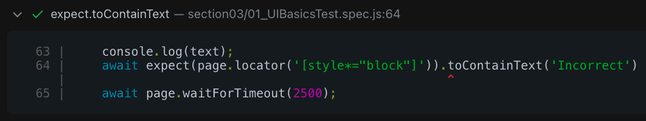
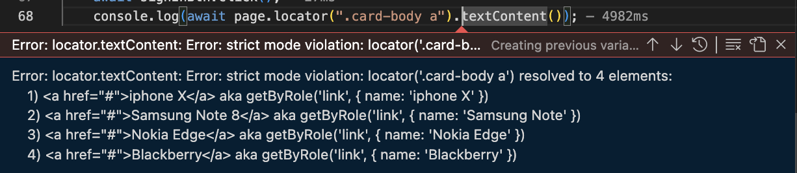

# Lecture 006 - Create npm Project and install Playwright dependencies
```javascript
$ npm init -y
$ npm init playwright@latest
$ javascript
$ tests
```

Test runner:
```javascript
Playwright-Project
 ├-- ...
 └-- playwright.config.js
```


Main folder/Working folder/ Test folder:

```javascript
PlaywrightProject
├-- ...
└-- tests
```


Examples:

```javascript
const { test, expect } = require('@playwright/test');

test.beforeEach( async ({page}) => {
  ...
});

test.describe('Describe test Title', () => {
  
  test('Test 01 title', async ({page}) => {
    ...
  });

  test('Test 02 title', async ({page}) => {
    ...
  });  
})
```


# Lecture 007 - Importance of Playwright Test annotations and Async await understanding

1. create a new test inside ./tests folder
2. add the following:
```javascript
const { test } = require('@playwright/test');

//test structure:
test('First Playwirght test', function() {
    //playwright code
    //step01 - open browser 
    //step02 - enter username & password
    //step03 - click submit button
    
});
```
3. async anonymous function with await in each step
```javascript
const { test } = require('@playwright/test');

//test structure:
test('First Playwirght test', async () => {
    //playwright code
    //step01 - open browser               => await
    await ....
    //step02 - enter username & password  => await
    await ....
    //step03 - click submit button        => await
    await ....
});
```

# Lecture 008: What is browser context and Page fixture in Playwright?

1. With context and plugins or cookies
```javascript
test('First Playwirght test', async ( {browser} ) => {
    //chrome - plugins/cookies/...
    const context = await browser.newContext();
    const page = await context.newPage();

    await page.goto("https://rahulshettyacademy.com/loginpagePractice/")
});
```

2. Without context and plugins or cookies
```javascript
test("First playwright test", async ( {page} ) => {
    await page.goto("https://rahulshettyacademy.com/loginpagePractice/");
})
```

# Lecture 009: Importance of Playwright Configuration file and its details to run the tests

```javascript
// @ts-check
const { defineConfig, devices } = require('@playwright/test');

module.exports = defineConfig({
  testDir: './tests',
  
  reporter: 'html',
  
  use: {
    trace: 'on-first-retry',
  },

  /* Configure projects for major browsers */
  projects: [
    {
      name: 'chromium',
      use: { ...devices['Desktop Chrome'] },
    },

    {
      name: 'firefox',
      use: { ...devices['Desktop Firefox'] },
    },

    {
      name: 'webkit',
      use: { ...devices['Desktop Safari'] },
    },
    {
      name: 'Microsoft Edge',
      use: { ...devices['Desktop Edge'], channel: 'msedge' },
    },
  ],

});
```

## Run from terminal:

### 1. execute all test cases inside ./tests folder: (headless mode?)
```javascript
$ npx playwright test
```

### 2. execute all test case from `./tests` folder with browser:
```javascript
$ npx playwright test --headed
```

#### 3. Run a specific test:
  #### - add `.only` to test as you see here:
```javascript
test.only("test scenario name", async ( {page} )=> {})
```
#### - then run command:
```javascript
$ npx playwright test
```

# Lecture 010: Running Playwright tests in multiple browsers - chrome, Firefox 7 Webkit

['Assertions in Playwright'](https://playwright.dev/docs/test-assertions)

1. add the following code:
```Javascript
const { expect } = require('@playwright/test');
```

2. Create a test scenario as follow:
```Javascript
test("second playwright test", async ( {page} ) => {
    // go to webpage:
    await page.goto("https://www.google.com");
    // get its title
    const title = await page.title();
    // make an assertion:
    expect(page).toHaveTitle('Google'); ❌
})
```
It will fail due to `await` is missing.

['Assertions - have title'](https://playwright.dev/docs/api/class-pageassertions#page-assertions-to-have-title)
- Expected title or RegExp.
```javascript
  await expect(page).toHaveTitle(/.*checkout/);
```

## headless mode:
```javascript
module.exports = defineConfig({
  use: {
    trace: 'on-first-retry', 
    headless : true, 
  }
})
```
1. run terminal - headless mode:
```javascript
$ npx playwright test
```
2. run terminal - open browser mode:
```javascript
$ npx playwright test --headed
```

## Headed mode:
```javascript
module.exports = defineConfig({
  use: {
    trace: 'on-first-retry', 
    headless : false, 
  }
})
```
1. run in terminal - open browser mode only:
```javascript
$ npx playwright test
```

# Lecture 011: Locators supported by playwright and how to type into elements on page
## Previous setting timeout:
1. setting a `timeout` only for `expect` around `20` seconds.
2. setting `timeout` for all over test is `30` seconds.
```javascript
export default defineConfig({
  timeout: 30 * 10000, //test
  expect: {
    timeout: 20000, //expect section
  },
});
```

## Locators:
1. Since we have following `HTML` code. How can you write a locator in Playwright?
```HTML
  <div class='form-group'>
    <input type='text' name='username' id='username' class='form-control'>
  <div>
```
- If `Id`is present:  `tagname#id` || `#id`
  ```CSS
    input#username
    #username
  ```

  ```javascript
  test("First playwright test- using #id locator", async ( {page} ) => {
    await page.goto("https://rahulshettyacademy.com/loginpagePractise/");
    await page.locator('#username').fill('luis');
    await page.waitForTimeout(2500);
  });
  ```

  ```javascript
  test("Second playwright test- using tagname#id locator", async ( {page} ) => {
    await page.goto("https://rahulshettyacademy.com/loginpagePractise/");
    await page.locator('input#username').fill('Lucho');
    await page.waitForTimeout(2500);
  }); 
  ```
- If `class` attribute is present: `tagname.class` || `.class`
  ```CSS
    input.form-control
    .form-control
  ````

  ```javascript
  test("Third playwright test- using .class locator", async ( {page} ) => {
    await page.goto("https://rahulshettyacademy.com/loginpagePractise/"); 

    await page.locator('.form-control#username').fill('luismedina');
    await page.waitForTimeout(2500);
  });
  ```

  ```javascript
  test("Fourth playwright test- using `tagname.class` locator", async ( {page} ) => {
    await page.goto("https://rahulshettyacademy.com/loginpagePractise/"); 

    await page.locator('input.form-control#username').fill('luiggie');
    await page.waitForTimeout(2500);
  });
  ```

- Write CSS based on any `attribute`: `[attribute='value']`
  ```CSS
    [name='username']
  ````

  ```javascript
  test("Fifth playwright test- using attribute locator", async ( {page} ) => {
    await page.goto("https://rahulshettyacademy.com/loginpagePractise/"); 
    await page.locator('[name="username"]').fill('luismedina');
    await page.waitForTimeout(2500);
  });
  ```

  ```javascript
  test("Sixth playwright test- using `tagname attribute` locator", async ( {page} ) => {
    await page.goto("https://rahulshettyacademy.com/loginpagePractise/"); 

    await page.locator('input[name="username"]').fill('luiggie');
    await page.waitForTimeout(2500);
  });  
  ```
- write CSS with `traversing` from `Parent to child`: `parentTagname >> childTagName`
  ```CSS
    .form-group > #username
  ````

  ```javascript
  test("Seventh playwright test- using `tagname attribute` locator", async ( {page} ) => {
    await page.goto("https://rahulshettyacademy.com/loginpagePractise/"); 

    await page.locator('.form-group #username').fill('luiggie');
    await page.waitForTimeout(2500);
  });
  ```
- If needs to write locator base on `text`: CSS
  
  ```

```javascript
  page.locator('locator')
```

# Lecture 012: Extracting the text from browser and inserting valid expect assertions in test

## Locators:
```javascript
    await page.locator('#username').fill('rahulshetty');
    await page.locator('[type="password"]').fill('learning');
    await page.locator('#signInBtn').click();
```

## Getting a warning text:
After clicking on `Sign In` button with non existent pr wrong credentials, there's a warning. 
[image](./Images/Section03/Warning_in_login_page.png)


### Goal: Extract the text
```html
<div class="alert alert-danger col-md-12" style="display: block;">
  <strong>Empty</strong> username/password.
</div>
```
the attribute which changes everything is `display:block` while this warning is visible, then it turns to `display:none`.

So the locator should be:
```javascript
await page.locator('[style*=block"]')
```
This `*` acts likely as style attribute has some value similarly to `block`.

```javascript
$ npx playwright test --headed tests/section03/01_UIBasicsTest.spec.js 
```

### In order to get its text: `.textContent()`
```javascript
const warningText = await page.locator('[style*="block"]').textContent();
console.log(warningText);
```

### In order to assert the text `.toContainText("...")`

#### Create a wrong assertion:
```javascript
const warningText = await page.locator('[style*="block"]').textContent();
...
await expect(page.locator('[style*="block"]')).toContainText('Incorrect1')
```


#### create a right assertion:
```javascript
const warningText = await page.locator('[style*="block"]').textContent();
...
await expect(page.locator('[style*="block"]')).toContainText('Incorrect')
```


when right locator or assertion:

```javascript
    await page.waitForTimeout(3000);
```

# Lecture 013: How to work with locators which extract multiple webelements in page

## You can create some variable without `await` for locators:
```javascript
test("Creating variable for locators", async ( {page} ) => {
    await page.goto("https://rahulshettyacademy.com/loginpagePractise/"); 

    //variables: without await
    const username = page.locator('#username');
    const password = page.locator('[type="password"]');
    const signInBtn = page.locator('#signInBtn');

    //actions => `await` is mandatory
    await username.fill('rahulshettyacademy');
    await password.fill('learning');
    await signInBtn.click();
    await page.waitForTimeout(6500);
});
```

## Common error when more than 1 element have same locator:

as you can see in this example, many elements have been found with same locator:
```javascript
await page.locator(".card-body a").textContent()
```



## Using `.nth(0)` or `.first()` in order to get first element:

### using `.nth(0)`
```javascript
await page.locator('.card-body a').nth(0).textContent();
```

### using `.first()`
```javascript
await page.locator('.card-body a').first().textContent();
```

so, `.nth(0)` and `.first()` have the same functionality.

```javascript
await page.locator('.card-body a').first().textContent();
await page.locator('.card-body a').nth(0).textContent();
await page.locator('.card-body a').nth(1).textContent();
await page.locator('.card-body a').nth(2).textContent();
```
