> # [Repo link](https://github.com/luismedinacoca/playwright_automation/blob/master/README.md)

# Lecture 006 - Create npm Project and install Playwright dependencies

## 1. create a Project folder

## 2. Open terminal in project folder path

## 3. run first and second commands:

```javascript
$ npm init -y
$ npm init playwright@latest
```

## 4. select

```javascript
-javascript - tests;
```

## 5. Test runner:

```javascript
Playwright-Project
 ├-- ...
 └-- playwright.config.js
```

## 6. Main folder/Working folder/ Test folder: (step 4)

```javascript
PlaywrightProject
├-- ...
└-- tests
```

## 7. Some Examples

```javascript
const { test, expect } = require('@playwright/test');

test.beforeEach( async ({page}) => {
  ...
});

test.describe('Describe test Title', () => {

  test('Test 01 title', async ({page}) => {
    ...
  });

  test('Test 02 title', async ({page}) => {
    ...
  });
})
```

# Lecture 007 - Importance of Playwright Test annotations and Async await understanding

1. create a new test inside ./tests folder
2. add the following:

```javascript
const { test } = require("@playwright/test");

//test structure:
test("First Playwirght test", function () {
  //playwright code
  //step01 - open browser
  //step02 - enter username & password
  //step03 - click submit button
});
```

3. async anonymous function with await in each step

```javascript
const { test } = require('@playwright/test');

//test structure:
test('First Playwirght test', async () => {
    //playwright code
    //step01 - open browser               => await
    await ....
    //step02 - enter username & password  => await
    await ....
    //step03 - click submit button        => await
    await ....
});
```

# Lecture 008: What is browser context and Page fixture in Playwright?

1. With context and plugins or cookies

```javascript
test("First Playwirght test", async ({ browser }) => {
  //chrome - plugins/cookies/...
  const context = await browser.newContext();
  const page = await context.newPage();

  await page.goto("https://rahulshettyacademy.com/loginpagePractice/");
});
```

2. Without context and plugins or cookies

```javascript
test("First playwright test", async ({ page }) => {
  await page.goto("https://rahulshettyacademy.com/loginpagePractice/");
});
```

# Lecture 009: Importance of Playwright Configuration file and its details to run the tests

```javascript
// @ts-check
const { defineConfig, devices } = require("@playwright/test");

module.exports = defineConfig({
  testDir: "./tests",

  reporter: "html",

  use: {
    trace: "on-first-retry",
  },

  /* Configure projects for major browsers */
  projects: [
    {
      name: "chromium",
      use: { ...devices["Desktop Chrome"] },
    },

    {
      name: "firefox",
      use: { ...devices["Desktop Firefox"] },
    },

    {
      name: "webkit",
      use: { ...devices["Desktop Safari"] },
    },
    {
      name: "Microsoft Edge",
      use: { ...devices["Desktop Edge"], channel: "msedge" },
    },
  ],
});
```

## Run from terminal:

### 1. execute all test cases inside ./tests folder: (headless mode?)

```javascript
$ npx playwright test
```

### 2. execute all test case from `./tests` folder with browser:

```javascript
$ npx playwright test --headed
```

#### 3. Run a specific test:

#### - add `.only` to test as you see here:

```javascript
test.only("test scenario name", async ({ page }) => {});
```

#### - then run command:

```javascript
$ npx playwright test
```

# Lecture 010: Running Playwright tests in multiple browsers - chrome, Firefox 7 Webkit

['Assertions in Playwright'](https://playwright.dev/docs/test-assertions)

1. add the following code:

```Javascript
const { expect } = require('@playwright/test');
```

2. Create a test scenario as follow:

```Javascript
test("second playwright test", async ( {page} ) => {
    // go to webpage:
    await page.goto("https://www.google.com");
    // get its title
    const title = await page.title();
    // make an assertion:
    expect(page).toHaveTitle('Google'); ❌
})
```

It will fail due to `await` is missing.

['Assertions - have title'](https://playwright.dev/docs/api/class-pageassertions#page-assertions-to-have-title)

- Expected title or RegExp.

```javascript
await expect(page).toHaveTitle(/.*checkout/);
```

## headless mode:
Open `playwright.config.ts` file then modify or add the following code:
```javascript
module.exports = defineConfig({
  use: {
    trace: "on-first-retry",
    headless: true,
  },
});
```

or 
```js
export default defineConfig({
  ...
  use: {
    // baseURL: 'http://127.0.0.1:3000',
    trace: 'on-first-retry',
    headless: true,
  },
  ...
});
```

1. run terminal - headless mode:

```javascript
$ npx playwright test
```

2. run terminal - open browser mode:

```javascript
$ npx playwright test --headed
```

## Headed mode:

```javascript
module.exports = defineConfig({
  use: {
    trace: "on-first-retry",
    headless: false,
  },
});
```

1. run in terminal - open browser mode only:

```javascript
$ npx playwright test
```

# Lecture 011: Locators supported by playwright and how to type into elements on page

## Previous setting timeout:

1. setting a `timeout` only for `expect` around `20` seconds.
2. setting `timeout` for all over test is `30` seconds.

```javascript
export default defineConfig({
  timeout: 30 * 10000, //test
  expect: {
    timeout: 20000, //expect section
  },
});
```

## Locators:

1. Since we have following `HTML` code. How can you write a locator in Playwright?

```HTML
  <div class='form-group'>
    <input type='text' name='username' id='username' class='form-control'>
  <div>
```

- If `Id`is present: `tagname#id` || `#id`

  ```CSS
    input#username
    #username
  ```

  ```javascript
  test("First playwright test- using #id locator", async ({ page }) => {
    await page.goto("https://rahulshettyacademy.com/loginpagePractise/");
    await page.locator("#username").fill("luis");
    await page.waitForTimeout(2500);
  });
  ```

  ```javascript
  test("Second playwright test- using tagname#id locator", async ({ page }) => {
    await page.goto("https://rahulshettyacademy.com/loginpagePractise/");
    await page.locator("input#username").fill("Lucho");
    await page.waitForTimeout(2500);
  });
  ```

- If `class` attribute is present: `tagname.class` || `.class`

  ```CSS
    input.form-control
    .form-control
  ```

  ```javascript
  test("Third playwright test- using .class locator", async ({ page }) => {
    await page.goto("https://rahulshettyacademy.com/loginpagePractise/");

    await page.locator(".form-control#username").fill("luismedina");
    await page.waitForTimeout(2500);
  });
  ```

  ```javascript
  test("Fourth playwright test- using `tagname.class` locator", async ({
    page,
  }) => {
    await page.goto("https://rahulshettyacademy.com/loginpagePractise/");

    await page.locator("input.form-control#username").fill("luiggie");
    await page.waitForTimeout(2500);
  });
  ```

- Write CSS based on any `attribute`: `[attribute='value']`

  ```CSS
    [name='username']
  ```

  ```javascript
  test("Fifth playwright test- using attribute locator", async ({ page }) => {
    await page.goto("https://rahulshettyacademy.com/loginpagePractise/");
    await page.locator('[name="username"]').fill("luismedina");
    await page.waitForTimeout(2500);
  });
  ```

  ```javascript
  test("Sixth playwright test- using `tagname attribute` locator", async ({
    page,
  }) => {
    await page.goto("https://rahulshettyacademy.com/loginpagePractise/");

    await page.locator('input[name="username"]').fill("luiggie");
    await page.waitForTimeout(2500);
  });
  ```

- write CSS with `traversing` from `Parent to child`: `parentTagname >> childTagName`

  ```CSS
    .form-group > #username
  ```

  ```javascript
  test("Seventh playwright test- using `tagname attribute` locator", async ({
    page,
  }) => {
    await page.goto("https://rahulshettyacademy.com/loginpagePractise/");

    await page.locator(".form-group #username").fill("luiggie");
    await page.waitForTimeout(2500);
  });
  ```

- If needs to write locator base on `text`: CSS

  ```

  ```

```javascript
page.locator("locator");
```

# Lecture 012: Extracting the text from browser and inserting valid expect assertions in test

## Locators:

```javascript
await page.locator("#username").fill("rahulshetty");
await page.locator('[type="password"]').fill("learning");
await page.locator("#signInBtn").click();
```

## Getting a warning text:

After clicking on `Sign In` button with non existent pr wrong credentials, there's a warning.
[image](./Images/Section03/Warning_in_login_page.png)
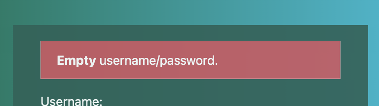

### Goal: Extract the text

```html
<div class="alert alert-danger col-md-12" style="display: block;">
  <strong>Empty</strong> username/password.
</div>
```

the attribute which changes everything is `display:block` while this warning is visible, then it turns to `display:none`.

So the locator should be:

```javascript
await page.locator('[style*=block"]');
```

This `*` acts likely as style attribute has some value similarly to `block`.

```javascript
$ npx playwright test --headed tests/section03/01_UIBasicsTest.spec.js
```

### In order to get its text: `.textContent()`

```javascript
const warningText = await page.locator('[style*="block"]').textContent();
console.log(warningText);
```

### In order to assert the text `.toContainText("...")`

#### Create a wrong assertion:

```javascript
const warningText = await page.locator('[style*="block"]').textContent();
...
await expect(page.locator('[style*="block"]')).toContainText('Incorrect1')
```

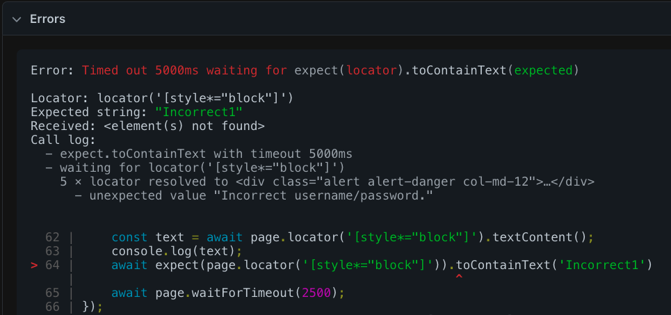

#### create a right assertion:

```javascript
const warningText = await page.locator('[style*="block"]').textContent();
...
await expect(page.locator('[style*="block"]')).toContainText('Incorrect')
```

when right locator or assertion:
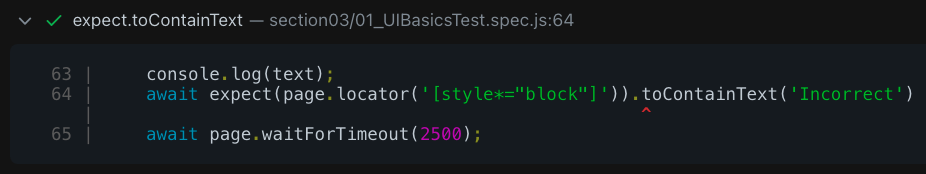

```javascript
await page.waitForTimeout(3000);
```

# Lecture 013: How to work with locators which extract multiple webelements in page

## You can create some variable without `await` for locators:

```javascript
test("Creating variable for locators", async ({ page }) => {
  await page.goto("https://rahulshettyacademy.com/loginpagePractise/");

  //variables: without await
  const username = page.locator("#username");
  const password = page.locator('[type="password"]');
  const signInBtn = page.locator("#signInBtn");

  //actions => `await` is mandatory
  await username.fill("rahulshettyacademy");
  await password.fill("learning");
  await signInBtn.click();
  await page.waitForTimeout(6500);
});
```

## Common error when more than 1 element have same locator:

as you can see in this example, many elements have been found with same locator:

```javascript
await page.locator(".card-body a").textContent();
```

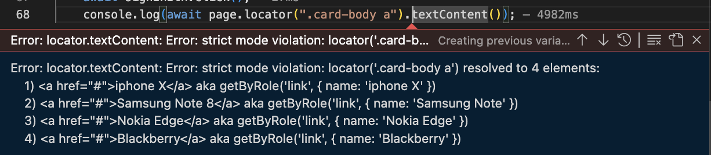

## Using `.nth(0)` or `.first()` in order to get first element:

### using `.nth(0)`

```javascript
await page.locator(".card-body a").nth(0).textContent();
```

### using `.first()`

```javascript
await page.locator(".card-body a").first().textContent();
```

so, `.nth(0)` and `.first()` have the same functionality.

```javascript
await page.locator(".card-body a").first().textContent();
await page.locator(".card-body a").nth(0).textContent();
await page.locator(".card-body a").nth(1).textContent();
await page.locator(".card-body a").nth(2).textContent();
```

# Lecture 014 - Understanding how wait mechanism works if list of elements are returned

1. First, getting text from elements with same locator using `.allTextContents()`

```javascript
//many elements same locator
const cardTitle = page.locator(".card-body a");
...
const allTitles = await cardTitle.allTextContents();
```

2. Assessment of `.allTextContents()` without previous searching:

```javascript
test("Assessment of .allTextContents() - no previous searching", async ({
  page,
}) => {
  await page.goto("https://rahulshettyacademy.com/loginpagePractise/");

  //variables: without await
  const username = page.locator("#username");
  const password = page.locator('[type="password"]');
  const signInBtn = page.locator("#signInBtn");
  const cardTitle = page.locator(".card-body a");

  //actions
  await username.fill("rahulshettyacademy");
  await password.fill("learning");
  await signInBtn.click();

  // no searching done!

  const allTitles = await cardTitle.allTextContents();
  console.log("allTitles", allTitles);
  console.log("allTitles.length: ", allTitles.length);
});
```

2.1 results:


3. Assessment of `.allTextContents()` with previous searching:

```javascript
test("Assessment of .allTextContents() - with previous searching", async ({
  page,
}) => {
  await page.goto("https://rahulshettyacademy.com/loginpagePractise/");

  //variables: without await
  const username = page.locator("#username");
  const password = page.locator('[type="password"]');
  const signInBtn = page.locator("#signInBtn");
  const cardTitle = page.locator(".card-body a");

  //actions
  await username.fill("rahulshettyacademy");
  await password.fill("learning");
  await signInBtn.click();

  // previous searching: 👈🏽 👈🏽 👈🏽 👈🏽
  console.log(await cardTitle.first().textContent());
  console.log(await cardTitle.nth(0).textContent());
  console.log(await cardTitle.nth(1).textContent());

  // to wrap all titles
  const allTitles = await cardTitle.allTextContents();
  console.log("allTitles", allTitles);
  console.log("allTitles.length: ", allTitles.length);
});
```

3.1 Result:


Note:

- `.textContent()` 
  * attached to DOM element.
  * returns first element which coincide.
  * returns a string|null
  * considers CSS hidden text
- `.allTextContents()` 
  * not attahced to DOM element.
  * returns an string[]
  * todos los elementos coincidentes

# Lecture 014 - Techniques to wait dynamically for new page in Service based applications

## 1. Having this known issue with `.allTextContents()`, let's do a backend searching:

### 1.1 Known Issue:

```js
test('Using .waitForLoadState("networkidle")', async ({ page }) => {
  await page.goto("https://rahulshettyacademy.com/client/");

  //locators:
  await page.locator("#userEmail").fill("anshika@gmail.com");
  await page.locator("#userPassword").fill("Iamking@000");
  await page.locator("[value='Login']").click();

  //...

  const titles = await page.locator(".card-body b").allTextContents();
  console.log("All Titles on page: ", titles);

  await page.waitForTimeout(2000);
});
```

Result:


### 1.2. Fixing this known issue using `.waitForLoadState("networkidle")` right before the `.allTextContents()` method is called:

```javascript
...
//wait mechanism: await page.waitForLoadState("networkidle");
await page.waitForLoadState("networkidle");
const titles = await page.locator(".card-body b").allTextContents();
```

This method wait until all backend calls are ready.


### 1.3 Currently `.waitForLoadState('networkidle')` shows flakiness, new fixing using `.waitFor()`:

Deleting `page.waitForLoadState("networkidle")` and replace for `page.locator("locator").waitFor()`

```js
//await page.waitForLoadState("networkidle"); // ←←←←← flakiness
await page.locator(".card-body b").first().waitFor();
```

and whole test should be as follow:

```js
test("Using .waitFor() due to .waitForLoadState() flakiness", async ({
  page,
}) => {
  await page.goto("https://rahulshettyacademy.com/client/");

  //locators:
  await page.locator("#userEmail").fill("anshika@gmail.com");
  await page.locator("#userPassword").fill("Iamking@000");
  await page.locator("[value='Login']").click();

  //await page.waitForLoadState("networkidle"); // ← flakiness
  await page.locator(".card-body b").first().waitFor();
  const titles = await page.locator(".card-body b").allTextContents();

  console.log("All Titles on page: ", titles);
  await page.waitForTimeout(2000);
});
```

> more info related to `page.waitForLoadState('networkidle')` [here!](https://playwright.dev/docs/api/class-page#page-wait-for-load-state)


1.4 Another alternative using `cy.intercept()`:

```js
cy.intercept('https://rahulshettyacademy.com/api/ecom/product/get-all-produc').as('dataLoaded');
cy.visit('https://rahulshettyacademy.com/client/');
cy.wait('@dataLoaded');
cy.get('.card-body b').then(...)
```


### Run a specific file from terminal

```js
$ npx playwright test tests/<File_path>.spec.js
```

# Lecture 017 - Handling static `Select` dropdown with Playwright

1. Having this html code:

```html
<div class="form-group">
  <select class="form-control" data-style="btn-info">
    <option value="stud">Student</option>
    <option value="teach">Teacher</option>
    <option value="consult">Consultant</option>
  </select>
</div>
```

2. declare a locators as follow:

```js
const dropdown = page.locator("select.form-control");
```

3. enter its value using `.selectOption()`:

```js
dropdown.selectOption("consult");
```

4. `Consultant` option selected.

```html
<option value="consult">Consultant</option>
```

# Lecture 018 - Selecting radio buttons, Checkboxes and implement expect assertions

1. Comparisson table between `.toBeChecked()`and `.isChecked()`

| Feature       |             `.toBeChecked()`             |                 `.isChecked()`                  |
| ------------- | :--------------------------------------: | :---------------------------------------------: |
| Type          |             Assertion method             |                 Locator method                  |
| Purpose       | Asserts that a checkbox/radio is checked |     Checks the current state of the elelemt     |
| Returns       | `Throws an error` if the assertion fails |       Returns a boolean (`true`/`false`)        |
| Used in       |             Test validation              |     Conditional logic or state verification     |
| Example Usage | `await expect(checkbox).toBeChecked();`  | `const isChecked = await checkbox.isChecked();` |

2. Simple code:

```js
const checkbox = page.locator("#checkbox");
//more code...

// Check if the checkbox is checked (state check)
const isChecked = await checkbox.isChecked();
console.log(`Checkbox is checked: ${isChecked}`);

if (isChecked) {
  console.log("The checkbox is checked.");
} else {
  console.log("The checkbox is not checked.");
}

// Assert that the checkbox is checked
await expect(checkbox).toBeChecked();
```

3. Playwright code:

```js
//locator:
const radioBtns = page.locator(".radiotextsty");

//action
await page.locator(".radiotextsty").last().click();

//validation:
console.log(
  "Is  radioBtns.last().isChecked()? ",
  await radioBtns.last().isChecked()
); // true

//Assertion:
expect(radioBtns.last()).toBeChecked(); // pass
```

4. Why is `await` before or after `expect`?

```js
await expect(checkbox).toBeChecked(); //expect structure => locator
```

- `await expect(checkbox).toBeChecked();`: The `await` is outside because `.toBeChecked()` is an assertion method that internally performs asynchronous operations.
  - You wait for the entire assertion to complete.

```js
expect(await checkbox.isChecked()).toBeFalsy(); // expect structure => boolean value
```

- `expect(await checkbox.isChecked()).toBeFalsy();`: The `await` is inside because `.isChecked()` is a locator method that returns a promise.
  - You wait for the promise to resolve and then pass the result to `expect`.

# Lecture 019 - Using `asyn` & `await` with Assertions and understand validating the attributes

Having these locators:

```js
//locators:
const username = page.locator("#username");
const password = page.locator("#password");
const radioBtns = page.locator(".radiotextsty");
const checkbox = page.locator("#terms");
```

1. The `.toBeChecked()` action is performed outside, so `await` is for the whole action

```js
await expect(checkbox).toBeChecked();
```

2. In other way, `.isChecked()` action is performed inside the `expect`, therefore `await` goes inside as well.

```js
expect(await checkbox.isChecked());
```

> Review [toHaveattribute(name, value)](https://playwright.dev/docs/api/class-locatorassertions#locator-assertions-to-have-attribute)

having this element

```html
<a
  href="https://rahulshettyacademy.com/documents-request"
  class="blinkingText"
  target="_blank"
>
  Free Access to InterviewQues/ResumeAssistance/Material
</a>
```

use the folloing code:

```js
const documentLink = page.locator('a[href*="documents-request"]');

//...

await expect(documentLink).toHaveAttribute("class", "blinkingText");
```

# Lecture 020 - Handling Child window & tab with Playwright by Switching browser contexxt

```js
test("Child window handling", async ({ browser }) => {
  const context = await browser.newContext();
  const page = await context.newPage();
  await page.goto("https://rahulshettyacademy.com/loginpagePractise/");

  //locators:
  const documentLink = page.locator('a[href*="documents-request"]');

  await expect(documentLink).toHaveAttribute("class", "blinkingText");
  await expect(documentLink).toHaveClass("blinkingText");

  // Event Handling:
  const [newPage] = await Promise.all([
    context.waitForEvent("page"), // listen for any new page pending, rejected, fulfilled
    await documentLink.click(), // new page is opened
  ]);
  const redText = await newPage.locator(".red").textContent();
  console.log("Text from new tab: ", redText);
});
```

and from Gemini

```js
test("Open and handling a new Tab", async ({ browser }) => {
  const context = await browser.newContext();
  const page = await context.newPage();

  const documentLink = page.locator('a[href*="documents-request"]');

  await page.goto("https://rahulshettyacademy.com/loginpagePractise/");

  // Option 1: Using `page.waitForEvent` (Recommended)
  const [newPage] = await Promise.all([
    page.waitForEvent("popup"), // Wait for the 'popup' event
    documentLink.click(), // Click the link that opens the new tab
  ]);

  // Now you have the new page object in 'newPage'
  await newPage.waitForLoadState(); // Wait for the new page to load
  const newPageURL = await newPage.url();
  console.log("👉🏽 New Tab URL:", newPageURL);
  // Perform your assertions on the new page here
  await expect(newPage).toHaveURL(/documents-request/); // Example assertion

  //await newPage.waitForTimeout(3000);

  const redText = await newPage.locator(".red").textContent();
  console.log("👁️ Red text from new tab: ", redText);

  await newPage.close(); // Close the new tab
  await page.close(); // Close the original tab
  await context.close();
  await browser.close();
});
```

# Lecture 021 - What is Playwright Inspector? And how to debug the playwright script

## Executing in debug mode:

```js
$ npx playwright test test_path.spec.js --debug
```

It will open a playwright inspector window

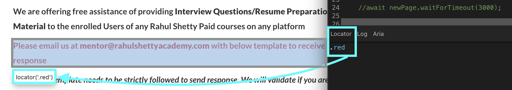

## Click on Record then click on "Pick Locator":

> 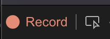

### Getting `Sign In` button selector with `getByRole()`:

> 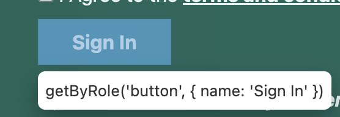

```js
await page.getByRole("button", { name: "Sign In" }).click();
```

### Getting `Terms and conditions` link selector with `getByRole()`:

> 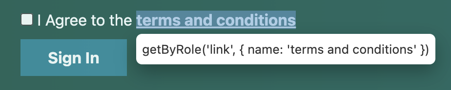

```js
await page.getByRole("link", { name: "terms and conditions" }).click();
```

### Getting `Okay` button link with `getByRole()`:

> 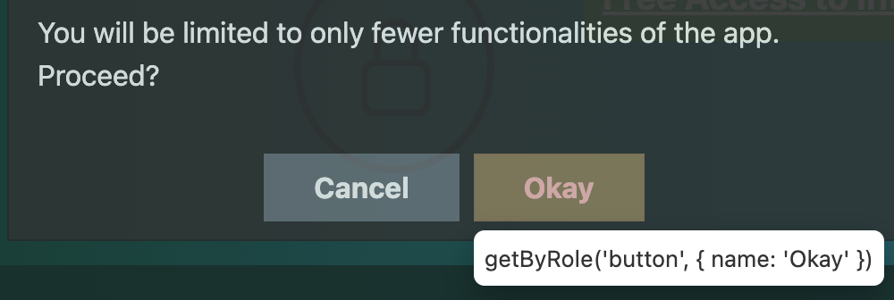

```js
await page.getByRole("button", { name: "Okay" }).click();
```

# Lecture 022 - Codegen tool to record & Playback with generated automation script

```js
$ npx playwright codegen URL_Link
```

# Lecture 024 - Detailed view of Test Traces, HTML reports, logs & Screenshots for test results

## 1. Create a screenshot for every log:

Go to `playwirght.config.js` file, and add `screenshot: 'on'` inside `module.exports` > `use`:

```js
module.exports = defineConfig({
  testDir: './tests',
  timeout: 15 * 1000,
  reporter: 'html',
  use: {
    screenshot: 'on',
    trace: 'retain-on-failure',
    headless : true,
  },
  expect: {
    timeout: 5_000,
  },
  ...
});
```

## 2. Click on trace screenshot

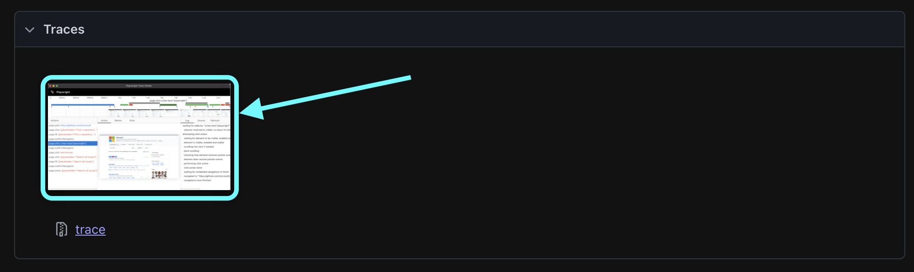
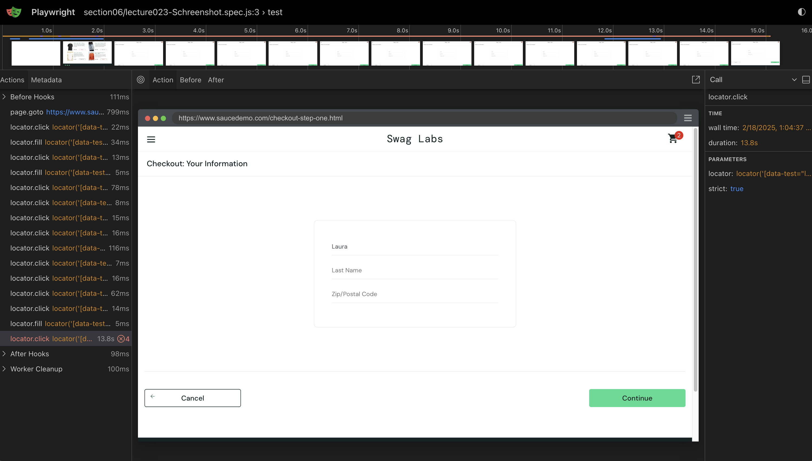

# Lecture 027 - CSS matching by text

Since this element:

```html
<a
  id="logout_sidebar_link"
  class="bm-item menu-item"
  href="#"
  data-test="logout-sidebar-link"
  style="display: block;"
  >Logout
</a>
```

Getting the element locator by Id:

```js
await page.locator("#logout_sidebar_link").click();
```

Getting the element locator by CSS selector: 🌟

```js
await page.locator("[id='logout_sidebar_link']:has-text('Logout')").click();
```

📌📌 Getting the element locator by `tag:has-text()`;

```js
await page.locator("a:has-text('Logout')").click();
```

[https://playwright.dev/docs/other-locators#css-locator](https://playwright.dev/docs/other-locators#css-locator)

# Lecture 033 - Understand how GetByLabel & Playwright UI Runner works with an example

## Using `.getByLabel()` for Radio buttons or Checkboxes

Having this checkbox:
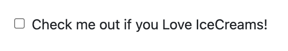

and its html code:

```html
<div class="form-check">
  <input class="form-check-input" id="exampleCheck1" type="checkbox" />
  <label class="form-check-label" for="exampleCheck1"
    >Check me out if you Love IceCreams!</label
  >
</div>
```

working with Playwright and using `.getByLabel()` would be like..

```js
test("Playwright special locators", async ({ page }) => {
  await page.goto("https://rahulshettyacademy.com/angularpractice/");

  await page.getByLabel("Check me out if you Love IceCreams!").click();
});
```

Having those radio buttons:
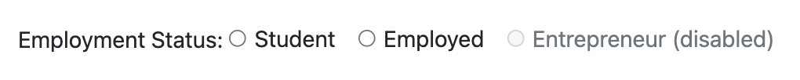

and its HTML code:

```html
<div class="form-group">
  <label for="exampleFormControlRadio1">Employment Status: </label>
  <div class="form-check form-check-inline">
    <input
      class="form-check-input"
      id="inlineRadio1"
      name="inlineRadioOptions"
      type="radio"
      value="option1"
    />
    <label class="form-check-label" for="inlineRadio1">Student</label>
  </div>

  <div class="form-check form-check-inline">
    <input
      class="form-check-input"
      id="inlineRadio2"
      name="inlineRadioOptions"
      type="radio"
      value="option2"
    />
    <label class="form-check-label" for="inlineRadio2">Employed</label>
  </div>

  <div class="form-check form-check-inline">
    <input
      class="form-check-input"
      disabled=""
      id="inlineRadio3"
      name="inlineRadioOptions"
      type="radio"
      value="option3"
    />
    <label class="form-check-label" for="inlineRadio3"
      >Entrepreneur (disabled)</label
    >
  </div>
</div>
```

Working with Playwright and using `.getByLabel()` would be like ..

```js
test("Playwright special locators", async ({ page }) => {
  await page.goto("https://rahulshettyacademy.com/angularpractice/");

  await page.getByLabel("Employed").check();

  const employedChecked = await page.getByLabel("Employed").isChecked();
  expect(employedChecked).toBeTruthy();
  if (employedChecked) {
    console.log("Employed radio button is checked");
  }
});
```

Having a dropdown:
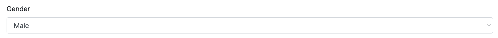

it's allows to use `.getByLabel()` method because they both have for in label and id in select, same value. As you can see in its html code is:

```html
<div class="form-group">
  <label for="exampleFormControlSelect1">Gender</label>
  <select class="form-control" id="exampleFormControlSelect1">
    <option>Male</option>
    <option>Female</option>
  </select>
</div>
```

working with Playwright and `.getByLabel()` would be like..

```js
test("Playwright special locators", async ({ page }) => {
  await page.goto("https://rahulshettyacademy.com/angularpractice/");

  await page.getByLabel("Gender").selectOption("Female");
});
```

working with accessibility:
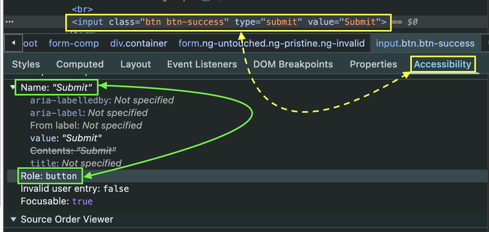

```js
const loginBtn = page.getByRole("button", { name: "Submit" });
await loginBtn.click();
```

# Lecture 042 - Validate if element is hidden or displayed mode with Playwright

## 1. Going back with `.goBack()` and going forward with `.goForward()` between pages:

```js
test("Going back and forward between different pages", async ({ page }) => {
  await page.goto("https://rahulshettyacademy.com/AutomationPractice/");
  await page.waitForTimeout(500);

  await page.goto("https://www.google.com/");
  await page.waitForTimeout(500);

  await page.goBack();
  await page.waitForTimeout(150);

  await page.goForward();
  await page.waitForTimeout(500);
});
```

## 2. Verifying whether an element is visible or not with `.toBevisible()` or `.toBeHidden()`:

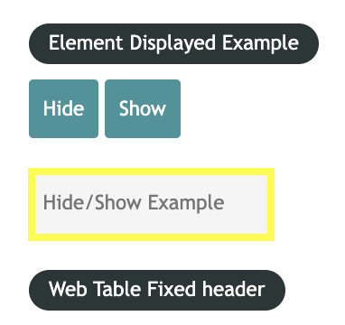

> after clicking on `Hide` button

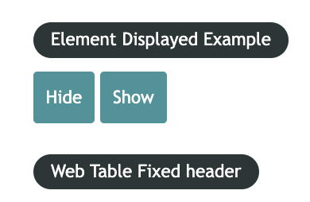

```js
test.only("`.toBeVisible() method`", async ({ page }) => {
  await page.goto("https://rahulshettyacademy.com/AutomationPractice/");

  await expect(page.locator("#displayed-text")).toBeVisible();

  //clicking on this element, it will hide the element:
  await page.locator("#hide-textbox").click();

  await expect(page.locator("#displayed-text")).toBeHidden();
});
```

# Lecture 043 - How to automate Java/Javascript Alert popups with Playwright

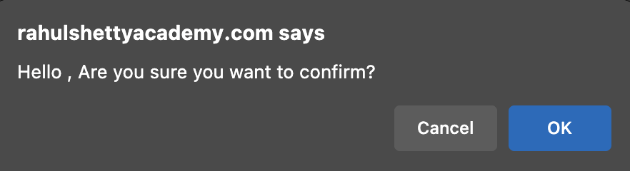

> 1. Any alert in Playwright is considered as `dialog`, so in this case we use `page.on()` with two parameters, one is a title and the other one is a callback function which needs dialog as argument.

```js
test("Alert or Dialog", async ({ page }) => {
  await page.goto("https://rahulshettyacademy.com/AutomationPractice/");

  // In playwright any alert is considered as "dialog"
  page.on("dialog", (dialog) => {
    ...
  });
  await page.locator("#confirmbtn").click();
});
```

> 2. In order to accept or confirm this alert/dialog, we need to apply the `dialog.accept()` method.

```js
test("Alert - Confirm", async ({ page }) => {
  await page.goto("https://rahulshettyacademy.com/AutomationPractice/");

  page.on("dialog", (dialog) => dialog.accept());
  await page.locator("#confirmbtn").click();
});
```

> 3. In order to cancel the alert/dialog we must apply `dialog.dismiss()` method.

```js
test("Alert - Confirm", async ({ page }) => {
  await page.goto("https://rahulshettyacademy.com/AutomationPractice/");

  page.on("dialog", (dialog) => dialog.dismiss());
  await page.locator("#confirmbtn").click();
});
```

> 4. In order to verify the alert/dialog message we should validate its message using `dialog.message()` method:

```js
test("Dismiss alert", async ({ page }) => {
  page.on("dialog", async (dialog) => {
    expect(dialog.message()).toContain(
      "Hello , Are you sure you want to confirm?"
    ); // Verify alert message
    await dialog.dismiss();
  });
});
```

## Mouse hover: `.hover()`

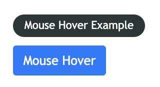
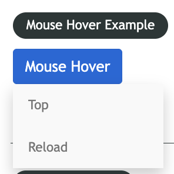

```js
test("Hover over the 'mouse hover' button", async ({ page }) => {
  await page.goto("https://rahulshettyacademy.com/AutomationPractice/");

  // scrolling near to mouse hover element:
  const totalAmount = await page.locator(".totalAmount");
  totalAmount.evaluate((element) => element.scrollIntoView());

  // #mousehover
  await page.locator("#mousehover").hover();
});
```

# Lecture 044 - How to handle & Automate frames

> Using `.frameLocator()` method.

```js
test("Alert - Confirm", async ({ page }) => {
  await page.goto("https://rahulshettyacademy.com/AutomationPractice/");

  const thirdBlock = await page.locator(".block").nth(3);
  thirdBlock.evaluate((Element) => Element.scrollIntoView());
  await page.waitForTimeout(1500);

  //clicking on iframe locator ID:
  const framePage = page.frameLocator("iframe#courses-iframe");

  //visible locator only
  framePage.locator('li a[href*="lifetime-access"]:visible').click();
  const textCheck = await framePage.locator(".text h2 span").textContent();

  console.log(textCheck);
  expect(textCheck).toBe("13,522");

  await page.waitForTimeout(1500);
});
```

# SECTION 10 - API Testing with Playwright and Build mix of Web & API tests

## Lecture 045 - Understanding the importance of API integration calls for Web tests

1. When you open this link [E-commerce - Rahul Shetty Academy](https://rahulshettyacademy.com/client), you'll enter your credentials as follows:
   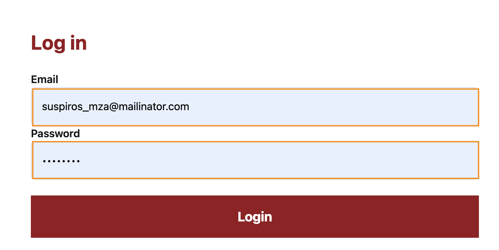
   then open devtools and select or click on "Network"

2. Click on `Login` button then click on `login` backend call as you can see in the picture:
   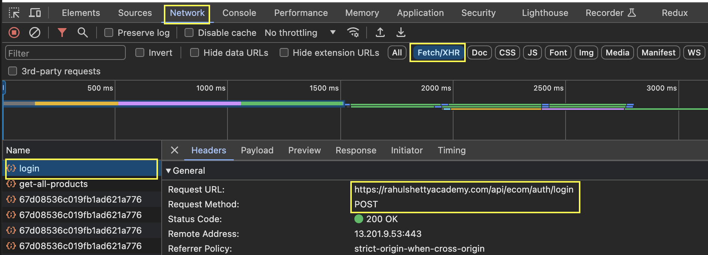
   You'll notice in Headers tab:

- request URL: `https://rahulshettyacademy.com/api/ecom/auth/login`
- request method: `POST`
- Status Code: `200`

3. Now you can click on `Payload` tab in order to see your credentials data
   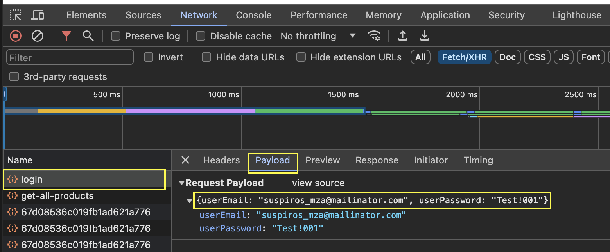

4. Click on `Response` tab in order to see the `token` value and its status as `Login Successfully`
   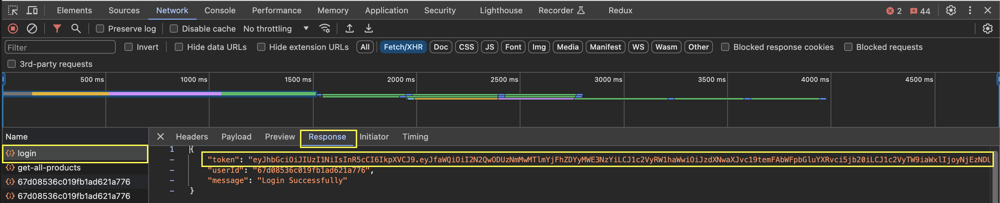

5. Another way to verify your token is clicking on `Application` - `Local Storage` - `URL` - `Token`
   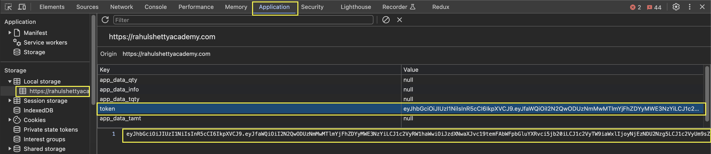

6. All before steps would be done in one step using `Postman` as follows:
   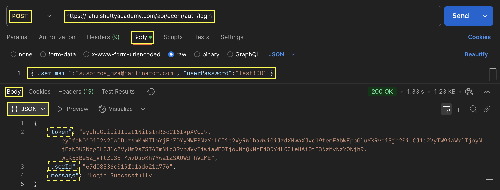

7. Once you got the token value, open a different browser, enter the same URL [E-commerce - Rahul Shetty Academy](https://rahulshettyacademy.com/client), open devtools, go to application, local storage, URL and add the token and its value. Refresh this page and you will be logged in without entering any credentials. This is main idea you can automate requesting the token value and inject this value in order to be looged in the e-commerce page without entering whole credentials at all.

## Lecture 046 - Playwright request method to make API calls and grab response - Example

```js
const token;

const loginPayload = {
  userEmail: "suspiros_mza@mailinator.com",
  userPassword: "Test!001",
};

test.beforeAll("Getting the token value", async({ request, page }) => {
  try {
    const loginResponse = await request.post(
      "https://rahulshettyacademy.com/api/ecom/auth/login", {
        data: loginPayload,
        headers: {
          "Content-Type": "application/json", // Asegura que el tipo de contenido es correcto
        },
      }
    );

    expect(loginResponse.ok()).toBeTruthy();
    expect(loginResponse.status()).toBe(200);

    const loginResponseJson = await loginResponse.json();
    expect(loginResponseJson.token).toBeDefined();

    token = loginResponseJson.token;
  } catch (error) {
    console.error("Error durante el login:", error);
    throw error;
  }
})

test.beforeEach("...", async ({ request, page }) => {
  //missing how to add the token in local storage browser...
})

test("...", async ({ request, page }) => {
  await page.goto("https://rahulshettyacademy.com/client/");
})
```

## Lecture 047 - Parsing API response & passing token to browser local storage with Playwright

1. How to inject the found token in local storage (application tab from devtools)

```JS
const token;

test.beforeAll("Getting the token value", async({ request, page }) => {

  // getting the token...
  token = loginResponseJson.token;
})

test("Parsing API token to browser local storage", async ({ page }) => {
  // it  would be better keep it in test.beforeEach()
  await page.addInitScript((value) => {
    window.localStorage.setItem("token", value);
  }, token);

  await page.goto("https://rahulshettyacademy.com/client/");
});
```

## Lecture 049 - End to end validation with mix of API & Web concepts - Reduce test time

`toBeDefined()` method:

```
.toBeDefined(): Verifica que el valor de orderResponseJson.orders no sea undefined.
```

# Lecture 050 - Important Prerequisite before going through next 2 videos

# Lecture 051 - Refactor API calls from utils folder and isolate from Web test logic & Lecture 052 - Part 2 - Refactor API calls from utils folder and isolate from Web test logic

Follow the structure:

```javascript
section10
|
├-- `data`
|    └-- payload.js
├-- `utils`
|    └-- APIutils.js
└-- `lecture051.spec.js`
```

## Create a `payload.js` file inside a data folde

```js
export const loginPayload = {
  userEmail: "suspiros_mza@mailinator.com",
  userPassword: "Test!001",
};

export const orderPayload = {
  orders: [
    {
      country: "Argentina",
      productOrderedId: "67a8dde5c0d3e6622a297cc8",
    },
    {
      country: "United Kingdom",
      productOrderedId: "67a8df1ac0d3e6622a297ccb",
    },
    {
      country: "Egypt",
      productOrderedId: "67a8df56c0d3e6622a297ccd",
    },
  ],
};
```

## Create a `APIutils.js` file inside a `utils` folder

1. create `utils` folder

2. Inside `utils` folder, create a `APIutils.js` file as follow:

```js
const { request, expect } = require("@playwright/test");

class APIutils {
  constructor() {
    this.token = null; // Almacenar el token aquí
  }
  //...
}
export { APIutils };
```

3. Inside `APIutils.js` file, we need to create 3 methods:

- getToken();
- injectTokenIntoLocalStorage();
- createOrder();

4. Inside `getToken()` method:

```js
async getToken(request, loginPayload) {
  try {
    const loginResponse = await request.post(
      "https://rahulshettyacademy.com/api/ecom/auth/login",
      {
        data: loginPayload,
        headers: {
          "Content-Type": "application/json",
        },
      }
    );

    expect(loginResponse.ok()).toBeTruthy();
    expect(loginResponse.status()).toBe(200);

    const loginResponseJson = await loginResponse.json();
    expect(loginResponseJson.token).toBeDefined();

    this.token = await loginResponseJson.token;
    // Almacenar el token en la clase
    process.env.authToken = this.token;

    return this.token;

  } catch (error) {
    console.error("Error getting token:", error);
    throw error;
  }
}
```

5. Inside `injectTokenIntoLocalStorage()` method:

```js
async injectTokenIntoLocalStorage(page) {
  if (this.token) {
    await page.addInitScript((value) => {
      window.localStorage.setItem("token", value);
    }, this.token);
  } else {
    console.warn("Token is not available. Call getToken() first.");
  }
}
```

6. Inside `createOrder()` method:

```js
async createOrder(request, orderPayload) {
  try {
    if (!this.token) {
      throw new Error("Token is not available. Call getToken() first.");
    }

    const orderResponse = await request.post(
      "https://rahulshettyacademy.com/api/ecom/order/create-order",
      {
        data: orderPayload,
        headers: {
          Authorization: this.token, // Usar el token almacenado
          "Content-Type": "application/json",
        },
      }
    );

    const orderResponseJson = await orderResponse.json();
    expect(orderResponseJson.orders).toBeDefined();

    const newOrders = orderResponseJson.orders;
    const orderId = orderResponseJson.orders[0];

    return orderId;

  } catch (error) {
    console.error("Error creating order:", error);
    throw error;
  }
}
```

7. Finally the test is created:

```js
const { test, expect, request } = require("@playwright/test");
import { APIutils } from "./APIutils.js";
import { orderPayload, loginPayload } from "./data/payloads.js";

test.describe("API Tests", () => {
  let apiUtils;

  test.beforeAll(async ({ request }) => {
    apiUtils = new APIutils();
    await apiUtils.getToken(request, loginPayload); // Obtener el token una vez
  });

  test.beforeEach(async ({ page }) => {
    await apiUtils.injectTokenIntoLocalStorage(page); // Inyectar el token antes de cada test
  });

  test("Log Out from ecommerce Test", async ({ request, page }) => {
    await page.goto("https://rahulshettyacademy.com/client/");

    await page.getByRole("button", { name: "ORDERS" }).click();
    await page.waitForTimeout(2000);

    await page.getByRole("button", { name: "Sign Out" }).click();
    await page.waitForTimeout(1000);
  });

  test("Create Order Test", async ({ request, page }) => {
    await page.goto("https://rahulshettyacademy.com/client/");

    const orderId = await apiUtils.createOrder(request, orderPayload);
    expect(orderId).toBeDefined();

    await page.getByRole("button", { name: "ORDERS" }).click();
    await page.waitForTimeout(2500);

    await page.getByRole("button", { name: "Sign Out" }).click();
    await page.waitForTimeout(1500);
  });
});
```

# Lecture 055 - How to save session storage using Playwright and inject into new Browser context

Adding the following code:

```js
let webContext;
let page;

test.beforeAll(async ({ browser }) => {
  context = await browser.newContext();
  page = await context.newPage();

  await page.goto(`${URL}`);

  await page.locator("#userEmail").fill(`${email_or_username}`);
  await page.locator("#userPassword").fill(`${password}`);
  await page.locator("#login").click();

  // create a physical file where you will put/paste all cookies:
  await context.storageState({ path: "utils/state.json" });

  //copy all cookies in an external file place in "utils/state,json"
  webContext = await browser.newContext({ storageState: "utils/state.json" });
});
```

in test.beforeEach section code:

```js
test.beforeEach(async () => {
  page = await webContext.newPage();
  await page.goto(`${URL}`);
});
```

Then continue with each test case:

```js
test("Test 001 - do something", async () => {
  const titles = await page.locator("title-locator").allTextContents();
  //...
});

test("Test 002 - do something else - ", async () => {
  await page.getByRole("button", { name: "Cart" }).click();
  //...
});
```

Remember:

> the last test case must have the sign-out action only!

# Lecture 056 - How to debug the API steps in script using Visual code debugging

1. For debugging UI, use:

```js
$ npx playwright test [test_case_relative_path] --headed --debug
```

i.e.:

> npx playwright test tests/section10/lecture051.spec.js --headed

## In case you need to debug for API test:

1. Add a `script` for a specific test case inside `package.json` file:

```js
"scripts": {
  "test": "npx playwright test [test_case_relative_path] --headed"
},
```

i.e.

```js
"scripts": {
  "test": "npx playwright test tests/section10/lecture051.spec.js --headed"
},
```

2. Add a debug point anywhere API code.

3. with `shift + ctrl + P` or `shift + cmd + P` you got access to `Debug: Debug npm Script`, then hit enter.
   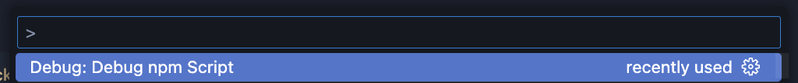

4. Becareful with the timeout, so increase its timeout to `100*1000` in `playwright.config.js` file:

```js
module.exports = defineConfig({
  testDir: "./tests",
  timeout: 100 * 1000,
  use: {
    video: "on",
    screenshot: "on",
    trace: "on",
    headless: true,
  },
  expect: {
    timeout: 5_000,
  },
});
```

# Lecture 057 -

[Trace for trace.zip file](https://trace.playwright.dev/)
Upload the `trace.zip` inside `test-result` folder.

```js
$ npx allure serve allure-results
```

# Lecture 068 -

```javascript
//Workbook Methods
const workbook = new Excel.Workbook();

new Excel.Workbook(); //Creates a new workbook
workbook.xlsx.readFile(path); // Reads an Excel file from disk
workbook.xlsx.writeFile(path); // Writes workbook to disk as Excel file
workbook.xlsx.load(buffer); // Loads workbook from buffer
workbook.csv.readFile(path); // Reads a CSV file
workbook.csv.writeFile(path); // Writes a CSV file
workbook.addWorksheet(name); // Adds a new worksheet with specified name
workbook.getWorksheet(name / id); // Gets a worksheet by name or id
workbook.removeWorksheet(name / id); // Removes a worksheet

//Worksheet Methods

const worksheet = workbook.getWorksheet("Sheet1");

worksheet.getCell(address); // Gets cell by address (e.g., 'A1')
worksheet.getRow(rowNumber); // Gets a row by number
worksheet.getColumn(columnKey); // Gets a column by key (number or letter)
worksheet.eachRow(callback); // Iterates through all rows
worksheet.addRow(data); // Adds a new row with data
worksheet.insertRow(rowIndex, data); // Inserts a row at specified index
worksheet.mergeCells(range); // Merges cells in specified range
worksheet.name; // Gets or sets worksheet name
worksheet.columns; // Sets column definitions/properties
worksheet.getColumnKey(column); // Gets column letter from index

//Cell Methods

cell.value; // Gets or sets cell value
cell.formula; // Gets or sets cell formula
cell.type; // Gets or sets cell type
cell.style; // Access to cell styling properties
cell.address; // Gets the cell address (e.g., 'A1')
cell.numFmt; // Gets or sets number format

//Row Methods

row.getCell(columnKey); // Gets cell in specified column
row.values; // Gets or sets values for the entire row
row.height; // Gets or sets row height
row.hidden; // Gets or sets row visibility
row.commit(); // Commits row changes

//Column Methods

column.width; // Gets or sets column width
column.hidden; // Gets or sets column visibility
column.key; // Gets or sets column key
column.letter; // Gets column letter
column.eachCell(callback); // Iterates through cells in column
```

# Lecture 0 -

# Lecture 0 - Page Object Model:

## 1st POM version - Estructura Básica con Selectores Directos:

```js
class LoginPage {
  constructor(page) {
    this.page = page;
    this.usernameInput = "#username"; // Selector CSS
    this.passwordInput = 'input[name="password"]'; // Otro selector CSS
    this.loginButton = '//button[text()="Login"]'; // Selector XPath (ejemplo)
  }

  async enterUsername(username) {
    await this.page.fill(this.usernameInput, username);
  }

  async enterPassword(password) {
    await this.page.fill(this.passwordInput, password);
  }

  async clickLoginButton() {
    await this.page.click(this.loginButton);
  }

  async login(username, password) {
    await this.enterUsername(username);
    await this.enterPassword(password);
    await this.clickLoginButton();
  }
}

module.exports = LoginPage;
```

### Ventajas:

- Sencilla de entender e implementar.
- Funciona bien para páginas simples.

### Desventajas:

- Si los selectores cambian en la página, debes actualizar el POM en varios lugares.
- Puede volverse menos manejable para páginas complejas.

## 2nd POM version - Agrupando Selectores en un Objeto:

```js
class LoginPage {
  constructor(page) {
    this.page = page;
    this.selectors = {
      usernameInput: "#username",
      passwordInput: 'input[name="password"]',
      loginButton: '//button[text()="Login"]',
    };
  }

  async enterUsername(username) {
    await this.page.fill(this.selectors.usernameInput, username);
  }

  async enterPassword(password) {
    await this.page.fill(this.selectors.passwordInput, password);
  }

  async clickLoginButton() {
    await this.page.click(this.selectors.loginButton);
  }

  async login(username, password) {
    await this.enterUsername(username);
    await this.enterPassword(password);
    await this.clickLoginButton();
  }
}

module.exports = LoginPage;
```

### Ventajas:

- Centraliza los selectores, facilitando la actualización si cambian.
- Mejora la legibilidad al separar la lógica de interacción de los selectores.

### Desventajas:

- Aún depende directamente de los selectores.

## 3rd POM version - Utilizando Funciones para Obtener Elementos

En lugar de almacenar directamente los selectores, puedes crear funciones que devuelvan los elementos de la página. Esto puede ser útil si la forma de localizar un elemento se vuelve más compleja.

```js
class LoginPage {
  constructor(page) {
    this.page = page;
  }

  getUsernameInput() {
    return this.page.locator("#username");
  }

  getPasswordInput() {
    return this.page.locator('input[name="password"]');
  }

  getLoginButton() {
    return this.page.locator('//button[text()="Login"]');
  }

  async enterUsername(username) {
    await this.getUsernameInput().fill(username);
  }

  async enterPassword(password) {
    await this.getPasswordInput().fill(password);
  }

  async clickLoginButton() {
    await this.getLoginButton().click();
  }

  async login(username, password) {
    await this.enterUsername(username);
    await this.enterPassword(password);
    await this.clickLoginButton();
  }
}

module.exports = LoginPage;
```

### Ventajas:

- Ofrece mayor flexibilidad si la lógica para localizar elementos se vuelve compleja.
- Puede mejorar la abstracción.

### Desventajas:

- Ligeramente más verboso

## 4th POM version - Combinando Selectores Agrupados con Funciones

Puedes combinar las ventajas de agrupar selectores con la flexibilidad de las funciones para obtener elementos.

```js
class LoginPage {
  constructor(page) {
    this.page = page;
    this.selectors = {
      usernameInput: "#username",
      passwordInput: 'input[name="password"]',
      loginButton: '//button[text()="Login"]',
    };
  }

  // getting for each locator:
  getUsernameInput() {
    return this.page.locator(this.selectors.usernameInput);
  }

  getPasswordInput() {
    return this.page.locator(this.selectors.passwordInput);
  }

  getLoginButton() {
    return this.page.locator(this.selectors.loginButton);
  }

  // method in order to use each or more locators:
  async enterUsername(username) {
    await this.getUsernameInput().fill(username);
  }

  async enterPassword(password) {
    await this.getPasswordInput().fill(password);
  }

  async clickLoginButton() {
    await this.getLoginButton().click();
  }

  async login(username, password) {
    await this.enterUsername(username);
    await this.enterPassword(password);
    await this.clickLoginButton();
  }
}

module.exports = LoginPage;
```

### Ventajas:

- Combina la claridad de los selectores agrupados con la flexibilidad de las funciones.
- Buena estructura para proyectos medianos y grandes.

# Lecture 083 - various options in use property & setting up Project configurations

- create a new `playwright.config.js` file and renamed as `playwright.config1.js`.

- execute running the following command:

```js
  npx playwright test path_test_case --config playwright.config1.js
```

In order to change the viewport configuration:

```js
projects: [
  {
    name: "Microsoft Edge",
    use: {
        ...devices["Desktop Edge"],
      channel: "msedge",
      viewport: { width: 1512, height: 972 },
    },
  },
  {
    name: "Chromium",
    use: {
        ...devices["Desktop Chrome"],
      channel: "msedge",
      viewport: { width: 1920, height: 974 },
    },
  },
  {
    name: 'firefox',
    use: { ...devices['Desktop Firefox'] },
  },
  ...
]
```

# lecture 088: How to run tests parallely from the same file by extending test option behaviour

1. Running `parallel` test from same file: adding `test.describe.configure({ mode: "parallel" });`

```js
test.describe.configure({ mode: "parallel" });
test("test 001", async ({page}) {
  ...
});

test("test 002", async ({page}) {
  ...
});
```

`test 001` and `test 002` will be executed in parallel.

2. Running in `serial` mode test from same file: adding `test.describe.configure({ mode: "serial" });`

```js
test.describe.configure({ mode: "serial" });
test("test 001", async ({page}) {
  ...
});

test("test 002", async ({page}) {
  ...
});

test("test 003", async ({page}) {
  ...
});
```

`test 001` pass however `test 002` fails so `test 003` won't execute.

# Lecture 089 - Reason for test failures - Race condition - Fix them

```js
test.skip();
```

# Lecture 90: How to tag tests and control the execution from the command line parameters

1. Tags With Typescript/javascript:

```js
import { test } from "@playwright/test";
test("Mi test importante @regression @fast", async ({ page }) => {
  // ... la lógica de tu test
});
test("Otro test con varias etiquetas @e2e @auth @slow", async ({ page }) => {
  // ... la lógica de otro test
});
test("Este test solo tiene una etiqueta @smoke", async ({ page }) => {
  // ...
});
```

2. De forma más estructurada, podrías usar la propiedad tag dentro del objeto de configuración del test:

```js
import { test } from "@playwright/test";
test(
  "Mi test importante",
  async ({ page }) => {
    // ... la lógica de tu test
  },
  { tag: ["@regression", "@fast"] }
);

test(
  "Otro test con varias etiquetas",
  async ({ page }) => {
    // ... la lógica de otro test
  },
  { tag: ["@e2e", "@auth", "@slow"] }
);

test(
  "Este test solo tiene una etiqueta",
  async ({ page }) => {
    // ...
  },
  { tag: "@smoke" }
);
```

3. ejecutar los tests desde la línea de comandos, puedes usar estas etiquetas para incluir o excluir grupos específicos de tests

```bash
npx playwright test --grep @regression
```

```bash
playwright test @regression
```

Para ejecutar los tests etiquetados con @regression y @fast:

```bash
playwright test @regression @fast
```

Para ejecutar los tests etiquetados con @e2e o @smoke:

```bash
playwright test @e2e or @smoke
```

Para excluir los tests etiquetados con @slow

```bash
playwright test --exclude @slow
```

# Lecture 091 - How to generate HTML & Allure reporting for Playwright Framework tests

1. Install allure dependency/library:

```bash
npm i -D @playwright/test allure-playwright
```

2. run test cases.

```bash
npx playwright test --reporter=line,allure-playwright
```

```javascript
playwright-main-project
|
├-- .github
|    └-- ...
├-- `allure-results`
|    └-- ...
└-- tests
|    └-- ...
```

3. Run

```bash
allure generate ./allure-results --clean
```

4. Execute:

```bash
allure open ./allure-report
```

# Lecture 92: How to create custom scripts to trigger the tests from package.json file

Open `package.json` file:

```json
{
  "scripts": {
    "regression": "npx playwright test",
    "webtests": "npx playwright test --grep @web",
    "apitest": "npx playwright test --grep @api",
    "firefox-run": "npx playwright test --grep @inProgress --project=firefox"
  }
}
```

running from console:

```bash
npm run regression
```

```bash
npm run webtests
```

```bash
npm run apitest
```

```bash
npm run firefox-run
```

# Lecture 097: Deep dive into TypeScript type syntaxes and their usage - 1

1. Run the following command:

```bash
npm install --save-dev typescript
```

2. Running any javascript file from terminal:

```bash
node any_file_name.js
```

3. Running or executing any Typescript file:

```bash
tsc any_file_name.ts
```

# Cucumber - Playwright:

[Playwright and Cucumber: EASY SETUP](https://www.youtube.com/watch?v=Dt28z7OXOSA&list=PLYDwWPRvXB89caN5PHWDLrXJuyugu5Mg_&index=16)

## 1. Installation Steps

```js
// Create new project
$ mkdir playwright-cucumber-ts
$ cd playwright-cucumber-ts
$ npm init -y

//Install required packages
$ npm install --save-dev @playwright/test @cucumber/cucumber cucumber ts-node typescript
$ npm install --save-dev @types/node

//Initialize Playwright configuration
$ npx playwright install
```

## 2. Project Structure

```
playwright-cucumber-ts/
├── features/
│   └── login.feature
├── step-definitions/
│   └── login.steps.ts
├── pages/
│   └── login.page.ts
├── support/
│   └── hooks.ts
├── config/
│   └── cucumber.js
├── tsconfig.json
├── playwright.config.ts
└── package.json
```

another option:

```
playwright-cucumber-typescript/
├── node_modules/
├── src/
│   ├── features/
│   │   └── login.feature
│   ├── support/
│   │   └── hooks.ts
│   ├── page-objects/
│   │   └── LoginPage.ts
│   └── step-definitions/
│       └── login.steps.ts
├── package.json
├── package-lock.json
├── tsconfig.json
└── dist/   (will be created after TypeScript compilation)
```

## 3. Configuration Files

### tsconfig.json

```js
{
  "compilerOptions": {
    "target": "ES2020",
    "module": "commonjs",
    "strict": true,
    "esModuleInterop": true,
    "outDir": "./dist",
    "rootDir": "./",
    "moduleResolution": "node"
  },
  "include": ["**/*.ts"],
  "exclude": ["node_modules"]
}
```

### config/cucumber.js

```js
const { setDefaultTimeout } = require("@cucumber/cucumber");
const { chromium } = require("@playwright/test");

setDefaultTimeout(60 * 1000);

exports.config = {
  default: {
    paths: ["../features/**/*.feature"],
    require: ["../step-definitions/**/*.steps.ts"],
    requireModule: ["ts-node/register"],
    format: ["pretty"],
  },
};
```

### playwright.config.ts

```js
import { PlaywrightTestConfig } from "@playwright/test";

const config: PlaywrightTestConfig = {
  use: {
    headless: false,
    viewport: { width: 1280, height: 720 },
    actionTimeout: 5000,
  },
  projects: [
    {
      name: "chromium",
      use: { browserName: "chromium" },
    },
  ],
};

export default config;
```

## 4. Feature File (features/login.feature)

```js
Feature: Login
  Scenario: Success Login
    Given A web browser is at the saucelabs login page
    When A user enters the username "standard_user", the password "secret_sauce", and clicks on the login button
    Then the url will contains the inventory subdirectory
```

## 5. Step Definitions (step-definitions/login.steps.ts)

```js
import { Given, When, Then } from "@cucumber/cucumber";
import { LoginPage } from "../pages/login.page";
import { chromium, Page } from "@playwright/test";

let page: Page;
let loginPage: LoginPage;

Given("A web browser is at the saucelabs login page", async () => {
  page = await chromium.launch().then((browser) => browser.newPage());
  loginPage = new LoginPage(page);
  await loginPage.goto();
});

When(
  "A user enters the username {string}, the password {string}, and clicks on the login button",
  async (username: string, password: string) => {
    await loginPage.login(username, password);
  }
);

Then("the url will contains the inventory subdirectory", async () => {
  const url = await loginPage.getURL();
  expect(url).toContain("/inventory.html");
});
```

## 6. Hooks (support/hooks.ts)

```js
import { After, Before } from "@cucumber/cucumber";
import { chromium, Page, Browser } from "@playwright/test";

let browser: Browser;
let page: Page;

Before(async () => {
  browser = await chromium.launch();
  page = await browser.newPage();
});

After(async () => {
  await page.close();
  await browser.close();
});
```

## 7. Page Object Model (pages/login.page.ts)

```js
import { Page } from '@playwright/test';

export class LoginPage {
  readonly page: Page;

  constructor(page: Page) {
    this.page = page;
  }

  async goto() {
    await this.page.goto('https://www.saucedemo.com/');
  }

  async login(username: string, password: string) {
    await this.page.fill('#user-name', username);
    await this.page.fill('#password', password);
    await this.page.click('#login-button');
  }

  async getURL() {
    return this.page.url();
  }
}
```

## 8. Update `package.json` scripts

```json
"scripts": {
  "test": "cucumber-js --config ./config/cucumber.js",
  "test:headless": "HEADLESS=true cucumber-js --config ./config/cucumber.js"
}
```

### This setup includes:

1. TypeScript configuration
2. Page Object Model implementation
3. Cucumber integration with Playwright
4. Proper directory structure
5. Hooks for browser management
6. Configuration files for both Cucumber and Playwright

> Note: You might need to adjust the selectors in the page object if the actual selectors on saucedemo.com are different.

# Hooks - Cucumber

Hooks can be conditionally selected for execution based on the tags of the scenario.

```js
const { After, Before } = require("@cucumber/cucumber");

Before(function () {
  // This hook will be executed before all scenarios
});

Before({ tags: "@foo" }, function () {
  // This hook will be executed before scenarios tagged with @foo
});

Before({ tags: "@foo and @bar" }, function () {
  // This hook will be executed before scenarios tagged with @foo and @bar
});

Before({ tags: "@foo or @bar" }, function () {
  // This hook will be executed before scenarios tagged with @foo or @bar
});

// You can use the following shorthand when only specifying tags
Before("@foo", function () {
  // This hook will be executed before scenarios tagged with @foo
});
```

Hook in order to take a screenshot for each failed test:
```js
AfterStep(async ({result}) => {
  if(result.status === Status.FAILED) {
    await this.page.screenshot({path: `screenshoot-${Date.now()}.png`});
  }
})
```


# Execute Cucumber test cases from terminal 

1. a specific feature: `login.feature`
```
├── features/
    └── login.feature
```

  ```bash
  $ npm run cucumber features/login.feature
  ```

2. a specific tag: `@e2e`
  having this feature:
  ```js
  Feature: Login
    @e2e
    Scenario: Success Login
      Given A web browser is at the saucelabs login page
      When A user enters the username "standard_user", the password "secret_sauce", and clicks on the login button
      Then the url will contains the inventory subdirectory
  ```

  ```bash
  $ npm run cucumber --tags "@e2e"
  ```


# Lecture 110: Parameterization with Scenario outline

```js
Feature: Login Application
  @login
  @e2e

  Scenario Outline: 
  Given a login to this App with "<username>" and "<password>"
  Then Verify Error message is displayed

  Examples:
  |        username        |   password         |
  | user_name_example_001  | user_password_001  |
  | user_name_example_002  | user_password_002  |

```

# Lecture 111: Parallel execution
1. Create a feature file:

```js
// features/login.feature

  Feature: Login
    @e2e
    Scenario: Success Login
      Given A web browser is at the saucelabs login page
      When A user enters the username "standard_user", the password "secret_sauce", and clicks on the login button
      Then the url will contains the inventory subdirectory

    @validation
    Scenario Outline: 
    Given a login to this App with "<username>" and "<password>"
    Then Verify Error message is displayed

    Examples:
    |        username        |   password         |
    | user_name_example_001  | user_password_001  |
    | user_name_example_002  | user_password_002  |
```

2. Run from terminal as follows:
```bash
npm run cucumber features/login.feature --parallel 2 --exit
```
- This number 2 it's due to scenario numbers.

3. Generate a report with Cucumber:
```bash
npm run cucumber features/login.feature --format html:cucumber-report.html
```

4. Re-run those flaky test:
```bash
npm run cucumber features/login.feature --retry 1
```

# Lecture 112: Introduction to Azure & Playwright cloud workspace resource creation steps
1. Go to the follow [Azure URL](https://azure.microsoft.com/en-us/pricing/purchase-options/azure-account)

# Markdown code

[Dominando Markdown Listas: La Guía Definitiva.](https://denshub.com/es/mastering-markdown-lists/)

```
$ npm install @faker-js/faker --save-dev
$ npm install --save luxon
```

[Playwright API Testing Tutorail Crash Course 2024](https://youtu.be/lM-lqPun9P8)

New Playwright Framework [BakkappaN / MicrosoftD365CRMPlaywrightFramework](https://github.com/BakkappaN/MicrosoftD365CRMPlaywrightFramework/tree/main)
